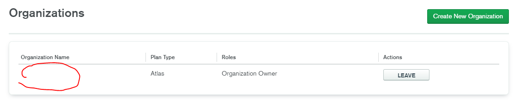
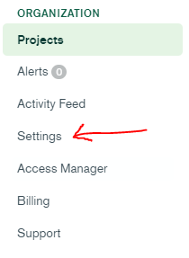
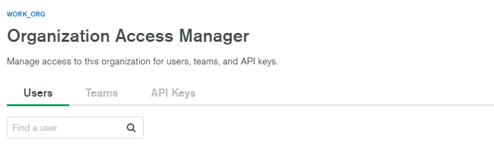
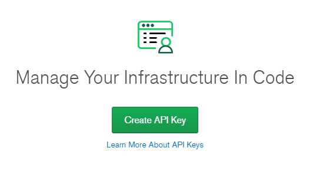
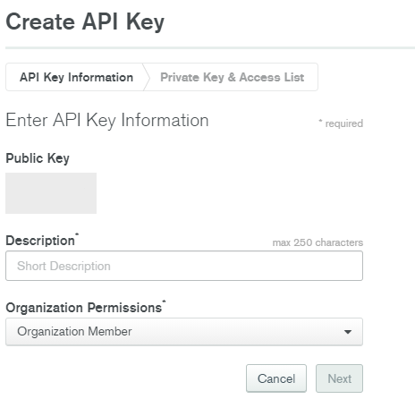
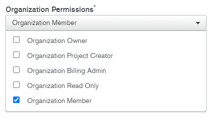

# Programmatic API Keysを発行する

## detail

外部アプリケーションからMongoDB Atlas上のデータを参照する際、API Keyが必要になる。MongoDBでは発行するAPI KeyとしてPersonal API KeyとProgrammatic API Keyの2つがある。が、[Personal API Keyは非推奨](https://docs.atlas.mongodb.com/configure-api-access/)になり新規発行ができなくなっている（既存のキーも2021年3月1日以降アクセスできなくなる）ので、ここではProgrammatic API Keyの発行手順について記述する。

1. MongoDB Atlasにログインする。
2. まず「API Access List」を有効にする必要があるので、画面右上のユーザー名をクリックする。
   
   

   表示されたメニューの中から「Organizations」をクリックする。

1. Organizationsページに遷移する。

   

   Organizationを作成していない場合は、右上の「Create New Organization」をクリックしてOrganizationを作成する。

   すでに作成済みの場合は一覧に表示されているはずなので、API Keyを発行したいOrganizationを選択する。

1. 個別のOrganizationのページに遷移する。

   

   左のメニューに存在するSettingをクリックする。

1. Organization Settingsのページに遷移する。

   

   「Require IP Access List for Public API」がデフォルト設定ではOFFになっているはずなので、このトグルボタンをONに変更する。

1. 一度個別のOrganizationのページまで戻る。

   

   左のメニューに存在するAccess Managerをクリックする。

1. Organization Access Managerのページに遷移する。

   

   「API Keys」タブをクリックする。

   

   初期状態ではAPI Keyは発行されていないはずなので、「Create API Key」をクリックする。

1. API Keyの発行ページに遷移する。
   
   

   この時点で公開鍵が発行されるので、これを任意のファイルなどに保存しておく。この公開鍵はAPIリクエストを行う際のユーザー名として機能する。Descriptionは必須項目なので、任意の文言を記入しておく。

   

   Organization Permissionsは実行権限の設定を行う。なお、権限の説明は同じページの右側に表示されているので、それを参考にしよう。

        Organization Permissions

        Organization Owner
        Provides root access to the organization, including: access to administer organization settings, users, and teams; access to delete the organization, and all permissions granted to the roles below.

        Organization Project Creator
        Provides project creation access as well as permissions granted to the Organization Member role.

        Organization Billing Admin
        Provides access to administer billing information for the organization as well as permissions granted to the Organization Member role.

        Organization Read Only
        Provides read-only access to everything in the organization, including all projects in the organization.

        Organization Member
        Provides read-only access to the organization (settings, users, and billing) and the projects to which they belong.

    一応現状では上記のパターンが存在している。

    必要な項目の入力が終わったらNextを押す。

1. 秘密鍵が生成されるので、適当なファイルにコピペしておく。この鍵は**このタイミング以降では表示されない**ので注意。ここで生成された秘密鍵は、APIリクエストを行う際のパスワードとして利用する。
2. 「Add Access List」は、Atlasが生成したAPI KeyによるAPIリクエストの際に、リクエストを受け付けるIPアドレスを指定できる。
3. Doneを押す。Organization Access Managerのページに遷移し、今生成したAPI Keyの情報が記載されているはず。

## reference

1. [Configure Atlas API Access](https://docs.atlas.mongodb.com/configure-api-access/)
2. [Programmatic API Keys](https://docs.atlas.mongodb.com/reference/api/apiKeys/)
3. [Calling the MongoDB Atlas API - How to do it from Node, Python, and Ruby](https://developer.mongodb.com/how-to/nodejs-python-ruby-atlas-api/)
