# TIL - MongoDB

MongoDBに関することはここに書く。

## MongoDBについて

### detail

[MongoDB](https://www.mongodb.com/)とは、NoSQLと呼ばれるタイプの構成を持つデータベースシステム。データ（レコード）をテーブルに格納するRDBMSと異なり、「ドキュメント」と呼ばれる構造的データをJSONライクな形式で表現し、そのドキュメントの集合体を「コレクション」として管理する。

NoSQLはその構造上、RDBMSよりもデータの追加・更新・削除などは高速に行える。また、扱うデータの特性によってはRDBMSよりも容易かつ迅速に開発できる特徴がある。また、冗長性に優れており、スケールアウトも容易である。

逆に、リレーショナルな構造を取ることができないため、RDBMSでは可能な結合操作（`join`のような操作）が行えない。そして、"NoSQL"であるためそもそもSQLが利用できない。また、トランザクション処理には一定の条件があり、RDBMSと同等に利用できるわけではない。

上記のような特徴を持つため、「大量のデータを処理したい」「スモールスタートしつつデータの増加に合わせてスケールアウトする」などのニーズに対応するため、webアプリの情報分析やIoTのデータ解析などに用いられる。

### reference

1. [MongoDB](https://www.mongodb.com/)
2. [やってみようNoSQL　MongoDBを最速で理解する](https://qiita.com/Brutus/items/8a67a4db0fdc5a33d549)
3. [MongoDBとは](https://www.designet.co.jp/faq/term/?id=TW9uZ29EQg)

## MongoDB Atlasを利用する

### detail

[MongoDB Atlas](https://www.mongodb.com/cloud/atlas)は、MongoDBのDBaaS。MongoDBのクラスタをクラウド上に作成でき、制限はあるものの無料で利用できる。

利用方法は下記の通り。

1. まずAtlasのユーザーアカウントを作成する。
   
    

    「Try free（こちらの場合、遷移先のページで「cloud」が選択されていることを確認すること）」か「Start free」のページにて、必要事項を入力してアカウントを作成する。

2. ログインする。
    
    ログイン直後はクラスタがないため、クラスタを作る「Create a Cluster」というページが表示されるはず。

    
    
    ここで前提条件として、MongoDB Atlasは「Organization > Project > Cluster」という階層で構成・管理されていることに注意。OrganizationとProjectは、本来のMongoDBには存在しないAtlas固有の単位らしい。Atlasでアカウントを作ると、OrganizationとProjectが1つずつ任意の名前で作成される。これらの名前はいつでも変更できるので、気になる場合は変更しておこう。
    
    Organizationは支払いの単位で、Projectは、ongoDBユーザー定義やセキュリティ設定などをまとめる単位らしい。ただし、無料のクラスタは1つのProjectに1つしか作れない。

1. クラスタを作る。

    クラスタを作る。なお、OrganizationやProjectとは異なり、クラスタのみ**名前が変更できない**ので注意が必要。逆に言えば、名前以外は後で変更できるので適当に作ってしまっていい。そもそも、クラスタを作成する段階ではサービスとリージョンくらいしか設定しない。

    

    「Build a Cluster」をクリック。

    

    右の無料な「Create a cluster」を選ぶ。

    

    AWS、GCP、Azureのいずれかが選択できるがこれは好きなものでいいと思う。ただし、選んだサービスで選択可能なリージョンが異なるので注意。AWSやAzureは日本のリージョンがないが、GCPはTokyoがある。

    適当に選んだらスクロールしよう。

    

    Tierを設定する。もちろん、M0。

    

    Addictional Settingsは、無料プランにおいてのみ意味がない（設定できる項目なし）なので無視していい。クラスタ名は、**1度決めると後で変更できない**ので注意。

    

    今作ってるよ！と言われるので、しばらく待とう。

    

    作成処理が終わると、上記のような表示に変化する。

1. ユーザー、ホワイトリストなどの設定を行う。

    Clusters画面の「CONNECT」を押すと、ユーザーを作成したり接続元のホワイトリストを作成可能。
    
    
    
    接続元のIPアドレスがここで設定可能。ただ、ここではとりあえず「Allow Access From Anywhere」と押す。

    

    ここでは真ん中の「Connect your application」を押す。遷移先の画面に表示される`mongodb+srv://`で始まるアドレスをコピーして控えておこう。ここまで終わったらCloseを押して終了する。
    
1. Databaseを作成する。

    現状ではクラスタを作っただけで、肝心のデータが格納されたDatabasは存在しない。よってDatabaseを作成する。

    

    Cluster内のCollectionsを選択する。データが存在しないので、サンプルデータをロードするかオリジナルのDatabaseを作成するかのメニューが存在する。ここでは後者を選択する。ちなみに、サンプルデータは350MBくらいあるらしい。

    

    DatabaseとCollectionの名前を入力する。Createを押すを作成が始まる。

    

    作成が終わったらFind内にある「Insert document」を押す。

    
    
    するとドキュメントを記述できる画面が出てくる。
    
    
    
    `{}`っぽいボタンを押すと、JSONそのもので記述できるエディタになるので、データ構造がすでに決まっているならこっちからデータを書くのが早いかもしれない。ここでは[Insert Documents](https://docs.mongodb.com/compass/current/documents/insert)のページに記述のあるテストデータをそのままコピペする。もともと記述されているデータはカッコも含めてすべて削除する。入力が完了したらInsertを押す。

    

    ドキュメントの格納が完了した。
    
    Atlas側の設定はこれで終わり。

2. Mongooseをインストールする。

    [Mongoose](https://mongoosejs.com/)はJS用のMongoDBアクセスライブラリ。データのアクセスを簡単に実装できる。

    追加したいアプリケーションのフォルダで、`npm i mongoose`を実行してインストールしておく。

3. 

### reference

1. [MongoDB](https://www.mongodb.com/)
2. [MongoDB Atlasを使い始める (MongoDB as a Service) ](https://qiita.com/nacam403/items/08c18a8234c82e2b304e)
3. [80日目：MongoDB AtlasをMongooseにつなげる＆Route Filesを作成](https://ashitamo-net.com/devconnectors-mongodb-mongoose/)
4. [mongoDB Atlas+mongooseでWebアプリをどうやって始めるんや？](https://qiita.com/taro_kawasaki/items/ea8fce2d640e09fea3a9)
5. [MongoDB Atlasに登録して使うまでの手順](https://www.virment.com/how-to-use-mongo-db-atlas/)
6. [MongoDB Atlasで無料で簡単にクラスタ化する](https://qiita.com/ka_nabell_dev/items/0e91ae7646ddc78e514f)
7. [Insert Documents](https://docs.mongodb.com/compass/current/documents/insert)

## Programmatic API Keysを発行する

### detail

外部アプリケーションからMongoDB Atlas上のデータを参照する際、API Keyが必要になる。MongoDBでは発行するAPI KeyとしてPersonal API KeyとProgrammatic API Keyの2つがある。が、[Personal API Keyは非推奨](https://docs.atlas.mongodb.com/configure-api-access/)になり新規発行ができなくなっている（既存のキーも2021年3月1日以降アクセスできなくなる）ので、ここではProgrammatic API Keyの発行手順について記述する。

1. MongoDB Atlasにログインする。
2. まず「API Access List」を有効にする必要があるので、画面右上のユーザー名をクリックする。
   
   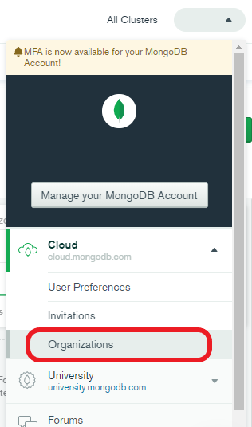

   表示されたメニューの中から「Organizations」をクリックする。

1. Organizationsページに遷移する。

   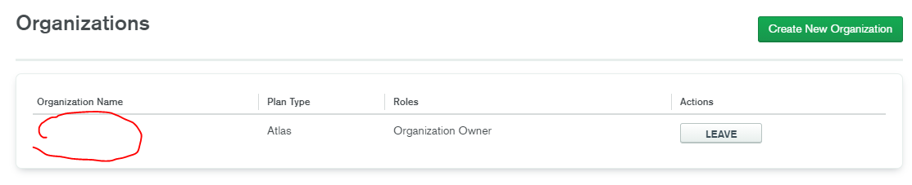

   Organizationを作成していない場合は、右上の「Create New Organization」をクリックしてOrganizationを作成する。

   すでに作成済みの場合は一覧に表示されているはずなので、API Keyを発行したいOrganizationを選択する。

1. 個別のOrganizationのページに遷移する。

   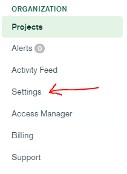

   左のメニューに存在するSettingをクリックする。

1. Organization Settingsのページに遷移する。

   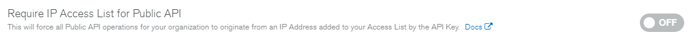

   「Require IP Access List for Public API」がデフォルト設定ではOFFになっているはずなので、このトグルボタンをONに変更する。

1. 一度個別のOrganizationのページまで戻る。

   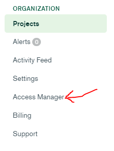

   左のメニューに存在するAccess Managerをクリックする。

1. Organization Access Managerのページに遷移する。

   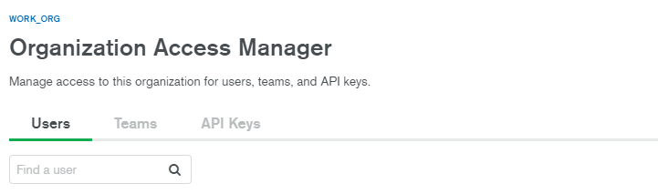

   「API Keys」タブをクリックする。

   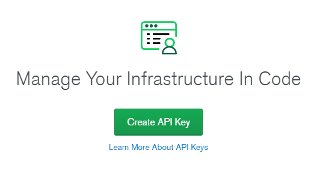

   初期状態ではAPI Keyは発行されていないはずなので、「Create API Key」をクリックする。

1. API Keyの発行ページに遷移する。
   
   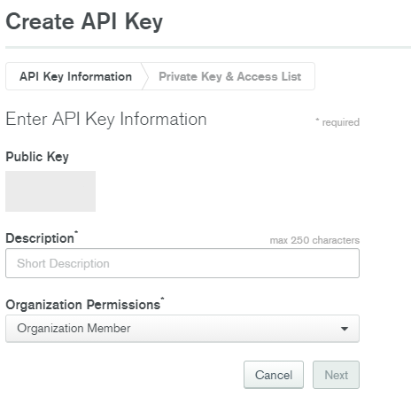

   この時点で公開鍵が発行されるので、これを任意のファイルなどに保存しておく。この公開鍵はAPIリクエストを行う際のユーザー名として機能する。Descriptionは必須項目なので、任意の文言を記入しておく。

   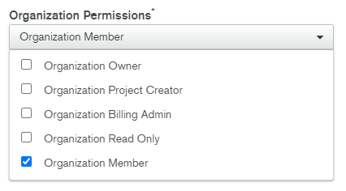

   Organization Permissionsは実行権限の設定を行う。なお、権限の説明は同じページの右側に表示されているので、それを参考にしよう。

        Organization Permissions

        Organization Owner
        Provides root access to the organization, including: access to administer organization settings, users, and teams; access to delete the organization, and all permissions granted to the roles below.

        Organization Project Creator
        Provides project creation access as well as permissions granted to the Organization Member role.

        Organization Billing Admin
        Provides access to administer billing information for the organization as well as permissions granted to the Organization Member role.

        Organization Read Only
        Provides read-only access to everything in the organization, including all projects in the organization.

        Organization Member
        Provides read-only access to the organization (settings, users, and billing) and the projects to which they belong.

    一応現状では上記のパターンが存在している。

    必要な項目の入力が終わったらNextを押す。

1. 秘密鍵が生成されるので、適当なファイルにコピペしておく。この鍵は**このタイミング以降では表示されない**ので注意。ここで生成された秘密鍵は、APIリクエストを行う際のパスワードとして利用する。
2. 「Add Access List」は、Atlasが生成したAPI KeyによるAPIリクエストの際に、リクエストを受け付けるIPアドレスを指定できる。
3. Doneを押す。Organization Access Managerのページに遷移し、今生成したAPI Keyの情報が記載されているはず。

### reference

1. [Configure Atlas API Access](https://docs.atlas.mongodb.com/configure-api-access/)
2. [Programmatic API Keys](https://docs.atlas.mongodb.com/reference/api/apiKeys/)
3. [Calling the MongoDB Atlas API - How to do it from Node, Python, and Ruby](https://developer.mongodb.com/how-to/nodejs-python-ruby-atlas-api/)

## PythonからMongoDB Atlasにアクセスする

### detail

PythonからMongoDB Atlasにアクセスしてデータを取得する方法について記述する。将来的にはAPIサーバーとして運用することを想定して、Flaskをついでに導入しておくことにする。

#### 前提

ここでは下記の処理が済んでいることを前提としている。

- MongoDB側にクラスターとデータベース、コレクションが既存である。
- Read権限あるいはReadとWrite権限を持ったユーザーを作成している。

プロジェクトのトップページから左メニュー内の「Database Access」を選択すると、ユーザーの一覧が表示される。ここで「Add new database user」ボタンをクリックすると、新しいユーザーを追加できる。ここの権限設定で「Only read any database」を選択しておけば、プロジェクト内におけるどのデータベースでもRead権限でアクセスできるようになる。

単純に接続確認をするだけなら初期ユーザーで行えばいいが、初期ユーザーはAdmin権限なのでただ接続確認するだけなら大げさだ。それに、恒常的に利用することを鑑みると、専用のユーザーを作成しておくほうが望ましいと思われる。ここではRead権限のみを持つchrisというユーザーを作成しておいた。

#### 手順

1. Pythonの環境を準備する。
2. `pip`で必要なライブラリをインストールする。
3. MongoDB Atlasで接続用のドライバーを発行する。
4. Pythonスクリプトを用意する。
5. 接続確認を行う。

#### Pythonの環境を準備する

Python自体の環境は、Dockerやローカルなど好きな方法で準備すればいい。後述する接続用ドライバーはPythonのバージョンで内容が異なるが、あまりに古いバージョンをあえて利用しなければならない場合を除けば、安定版を準備するべきと思う。どっちかって言うと注意が必要なのは、後述するMongoDBへの接続用のライブラリ。

#### `pip`で必要なライブラリをインストールする

MongoDBへ接続するのに必要なライブラリは`pymongo`というもの。ところがこれをインストールする際には、ちょっとした記述が必要になる。

```console
python -m pip install pymongo[snappy,gssapi,srv,tls]
あるいは
pip3 install pymongo[srv]
pip install pymongo[srv]
```

角カッコの中身なに？となるが、この中で最低でも`srv`は必要。`pip install pymongo`とだけ書くと、あとで実行したときに「dnspython must be installed error」という[わかりにくいエラーになってしまう](https://stackoverflow.com/questions/52930341/pymongo-mongodbsrv-dnspython-must-be-installed-error)。`pip`でこのように角カッコを記述するのは、**インストール対象のライブラリについて環境を指定したい**場合。つまり単純に`pymongo`とするだけではダメで、`srv`用環境としての`pymongo`が必要なわけだ。

とりあえず、最低限接続に必要なライブラリはこれだけだが、後々APIサーバーとして扱いたいのでFlaskもインストールしておこう。

#### MongoDB Atlasで接続用のドライバーを発行する

MongoDBには、いわゆるAPI Keyとは異なる接続用のドライバーが存在する。

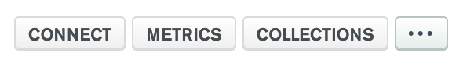

まずはとりあえず、いつもどおりMongoDB Atlasにログインする。次に接続したいクラスタの「CONNECT」ボタンを押す。

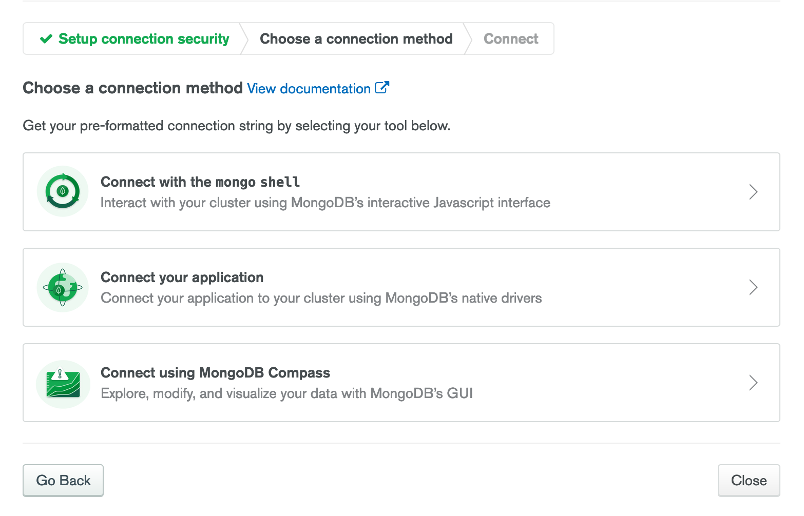

表示されたメニューのうち、真ん中の「Connect your application」を押す。

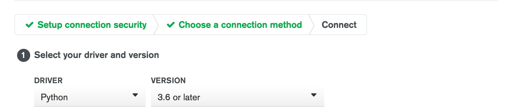

次に表示されたメニューから、接続元の環境を選択する。ここではPythonの3.6移行を選択した。すると、`mongodb+srv://`で始まる文字列が表示されると思うので、この文字列を丸々コピーする。後述するPythonスクリプトに記述するのだが、ここで編集が必要になるのは下記の項目。

- ユーザー名。これは`<username>`となっている部分を書き換える。もちろん`<>`の部分もだぞ！
- パスワード。これは`<password>`となっている部分を書き換える。もちろん`<>`の部分もだぞ！
- 接続先データベース名。これは`myFirstDatabase`となっている部分を書き換える。

> Replace <password> with the password for the <username> user. Replace myFirstDatabase with the name of the database that connections will use by default.

まぁこのページ内で上記のように注意書きされているので、書き換え忘れることはないと思うが。

#### Pythonスクリプトを用意する

Pythonスクリプトは下記の内容であれば、接続して値を取得できる。

```python
from flask import Flask
from flask_cors import CORS
import pymongo

connection_url = 'mongodb+srv://<USERNAME>:<PASSWORD>@hoge.fuga.mongodb.net/DATABASE_NAME?retryWrites=true&w=majority'

app = Flask(__name__)
client = pymongo.MongoClient(connection_url)

db = client.DATABASE_NAME
collection = db.COLLECTION_NAME

result = collection.find_one()
print(result)

if __name__ == '__main__':
    app.run(debug=True)

```

前述の通りだが、まずMongoDBに接続するドライバーの部分で書き換える必要があるのは3箇所。

- ユーザー名
- パスワード
- 接続先データベース名

さらに接続が確立したあとは、データを取得したいコレクションを指定して実際に値を取得する必要がある。

```python
db = client.DATABASE_NAME
collection = db.COLLECTION_NAME

result = collection.find_one()
print(result)
```

それをしているのが上記の部分。ここで`DATABASE_NAME`となっている部分には**実際のデータベース名を記述する**。データベース名が`hoge`という名前なら、上記のスクリプトなら`db.hoge`と記述すれば参照先データベースを指定できる。

なお、接続用ドライバーである`connection_url`の中で接続先データベース名を指定しているが、これは**デフォルトで使用するデータベース名**を記述している。クラスタ内にデータベースが複数あって、デフォルトでアクセスする先と実際に値を取得したい先が異なる場合などは上記のように接続先を逐一指定する。じゃあ、デフォルトの接続先と値の取得先が同じなら`client.DATABASE_NAME`の部分は不要なんじゃ？と思って`client.COLLECTION_NAME`と記述して実行してみたが、`find_one()`のところで「'Collection' object is not callable.」エラーになってしまった。そんなわけで、現状では上記の冗長な書き方をしている。

`COLLECTION_NAME`には、値の取得を実行したいコレクション名を記述する。コレクション名が`fuga`という場合、上記のスクリプトなら`db.fuga`と記述すれば参照先コレクションを指定できる。

`find_one()`は、とりあえずなんか1つデータくれという意味なので、検索する値を設定する場合は`find_one({'KEY': 'VALUE'})`と記述する。`find_one()`とだけ記述して実行する場合、最初のデータが参照される。

#### 接続確認を行う

ここまでスクリプトを書いたら実行してみる。結果がコンソールに出力されるはず。ここまでできれば、あとは「GETあるいはPOSTされたらMongoDBにアクセスして値を返す」ようなAPIサーバーとして記述しれやればいい。

### reference

1. [Connect to Your Cluster](https://docs.atlas.mongodb.com/tutorial/connect-to-your-cluster/)
2. [Insert and View Data in Your Cluster](https://docs.atlas.mongodb.com/tutorial/insert-data-into-your-cluster/)
3. [Make Python API to access Mongo Atlas Database](https://www.geeksforgeeks.org/make-python-api-to-access-mongo-atlas-database/)
4. [pymongo - mongodb+srv “dnspython must be installed” error](https://stackoverflow.com/questions/52930341/pymongo-mongodbsrv-dnspython-must-be-installed-error)
5. [Python: 環境ごとの依存ライブラリをセットアップスクリプトの extras_require で管理する](https://blog.amedama.jp/entry/2016/06/17/224532)
