# TIL - MongoDB

MongoDBに関することはここに書く。

## MongoDBについて

### detail

[MongoDB](https://www.mongodb.com/)とは、NoSQLと呼ばれるタイプの構成を持つデータベースシステム。データ（レコード）をテーブルに格納するRDBMSと異なり、「ドキュメント」と呼ばれる構造的データをJSONライクな形式で表現し、そのドキュメントの集合体を「コレクション」として管理する。

NoSQLはその構造上、RDBMSよりもデータの追加・更新・削除などは高速に行える。また、扱うデータの特性によってはRDBMSよりも容易かつ迅速に開発できる特徴がある。また、冗長性に優れており、スケールアウトも容易である。

逆に、リレーショナルな構造を取ることができないため、RDBMSでは可能な結合操作（`join`のような操作）が行えない。そして、"NoSQL"であるためそもそもSQLが利用できない。また、トランザクション処理には一定の条件があり、RDBMSと同等に利用できるわけではない。

上記のような特徴を持つため、「大量のデータを処理したい」「スモールスタートしつつデータの増加に合わせてスケールアウトする」などのニーズに対応するため、webアプリの情報分析やIoTのデータ解析などに用いられる。

### reference

1. [MongoDB](https://www.mongodb.com/)
2. [やってみようNoSQL　MongoDBを最速で理解する](https://qiita.com/Brutus/items/8a67a4db0fdc5a33d549)
3. [MongoDBとは](https://www.designet.co.jp/faq/term/?id=TW9uZ29EQg)

## MongoDB Atlasを利用する

### detail

[MongoDB Atlas](https://www.mongodb.com/cloud/atlas)は、MongoDBのDBaaS。MongoDBのクラスタをクラウド上に作成でき、制限はあるものの無料で利用できる。

利用方法は下記の通り。

1. まずAtlasのユーザーアカウントを作成する。
   
    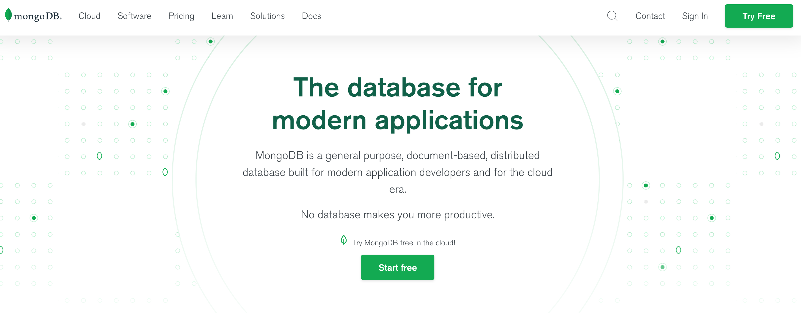

    「Try free（こちらの場合、遷移先のページで「cloud」が選択されていることを確認すること）」か「Start free」のページにて、必要事項を入力してアカウントを作成する。

2. ログインする。
    
    ログイン直後はクラスタがないため、クラスタを作る「Create a Cluster」というページが表示されるはず。

    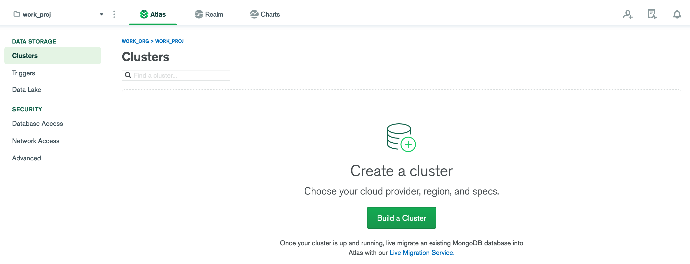
    
    ここで前提条件として、MongoDB Atlasは「Organization > Project > Cluster」という階層で構成・管理されていることに注意。OrganizationとProjectは、本来のMongoDBには存在しないAtlas固有の単位らしい。Atlasでアカウントを作ると、OrganizationとProjectが1つずつ任意の名前で作成される。これらの名前はいつでも変更できるので、気になる場合は変更しておこう。
    
    Organizationは支払いの単位で、Projectは、ongoDBユーザー定義やセキュリティ設定などをまとめる単位らしい。ただし、無料のクラスタは1つのProjectに1つしか作れない。

1. クラスタを作る。

    クラスタを作る。なお、OrganizationやProjectとは異なり、クラスタのみ**名前が変更できない**ので注意が必要。逆に言えば、名前以外は後で変更できるので適当に作ってしまっていい。そもそも、クラスタを作成する段階ではサービスとリージョンくらいしか設定しない。

    

    「Build a Cluster」をクリック。

    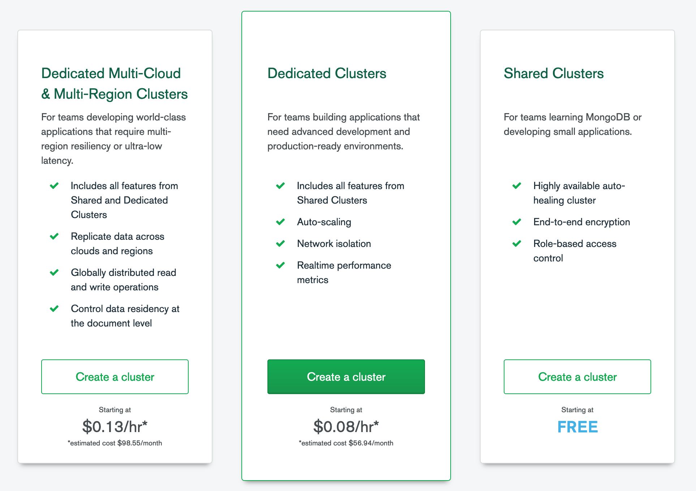

    右の無料な「Create a cluster」を選ぶ。

    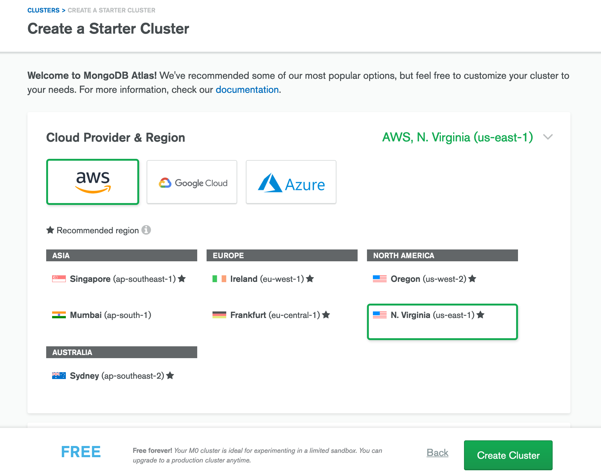

    AWS、GCP、Azureのいずれかが選択できるがこれは好きなものでいいと思う。ただし、選んだサービスで選択可能なリージョンが異なるので注意。AWSやAzureは日本のリージョンがないが、GCPはTokyoがある。

    適当に選んだらスクロールしよう。

    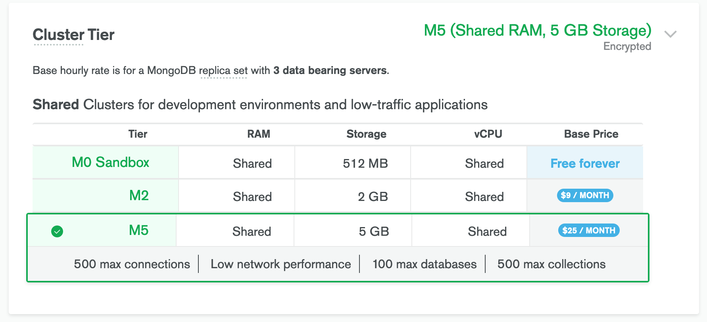

    Tierを設定する。もちろん、M0。

    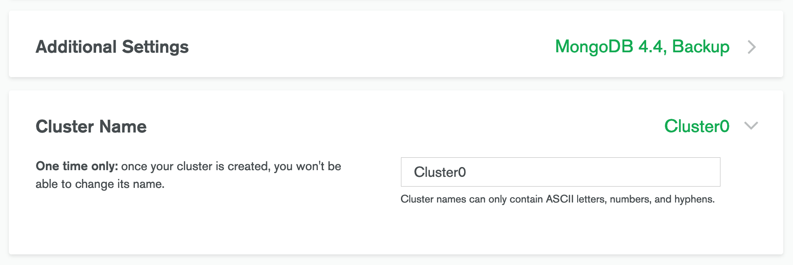

    Addictional Settingsは、無料プランにおいてのみ意味がない（設定できる項目なし）なので無視していい。クラスタ名は、**1度決めると後で変更できない**ので注意。

    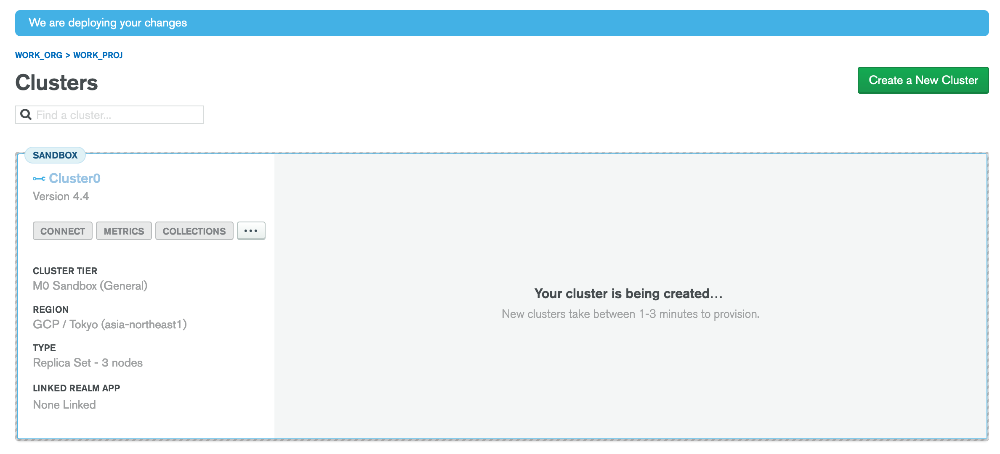

    今作ってるよ！と言われるので、しばらく待とう。

    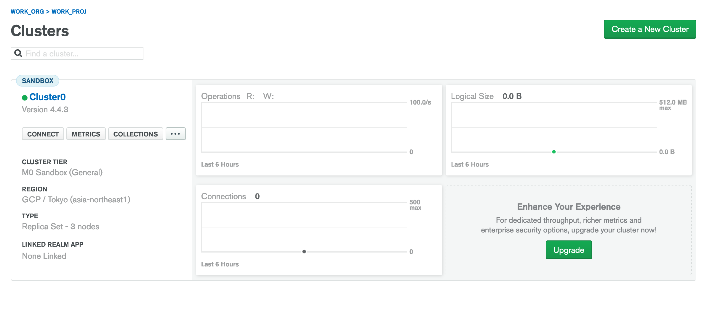

    作成処理が終わると、上記のような表示に変化する。

1. ユーザー、ホワイトリストなどの設定を行う。

    Clusters画面の「CONNECT」を押すと、ユーザーを作成したり接続元のホワイトリストを作成可能。
    
    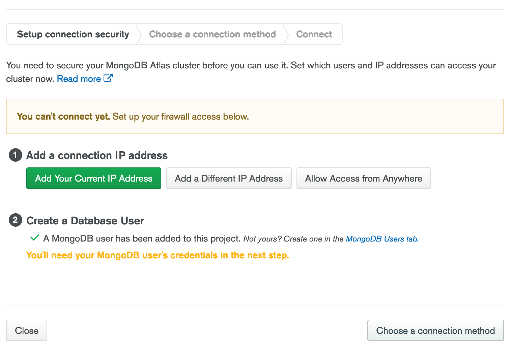
    
    接続元のIPアドレスがここで設定可能。ただ、ここではとりあえず「Allow Access From Anywhere」と押す。

    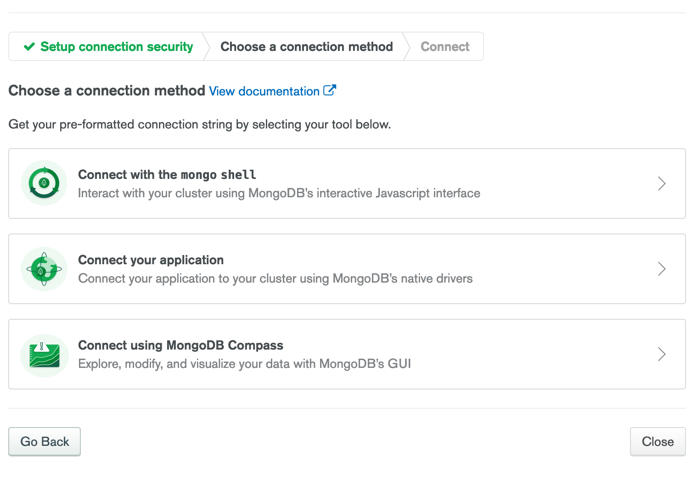

    ここでは真ん中の「Connect your application」を押す。遷移先の画面に表示される`mongodb+srv://`で始まるアドレスをコピーして控えておこう。ここまで終わったらCloseを押して終了する。
    
1. Databaseを作成する。

    現状ではクラスタを作っただけで、肝心のデータが格納されたDatabasは存在しない。よってDatabaseを作成する。

    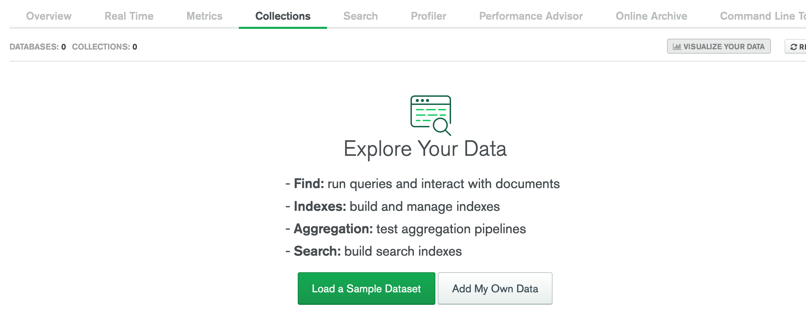

    Cluster内のCollectionsを選択する。データが存在しないので、サンプルデータをロードするかオリジナルのDatabaseを作成するかのメニューが存在する。ここでは後者を選択する。ちなみに、サンプルデータは350MBくらいあるらしい。

    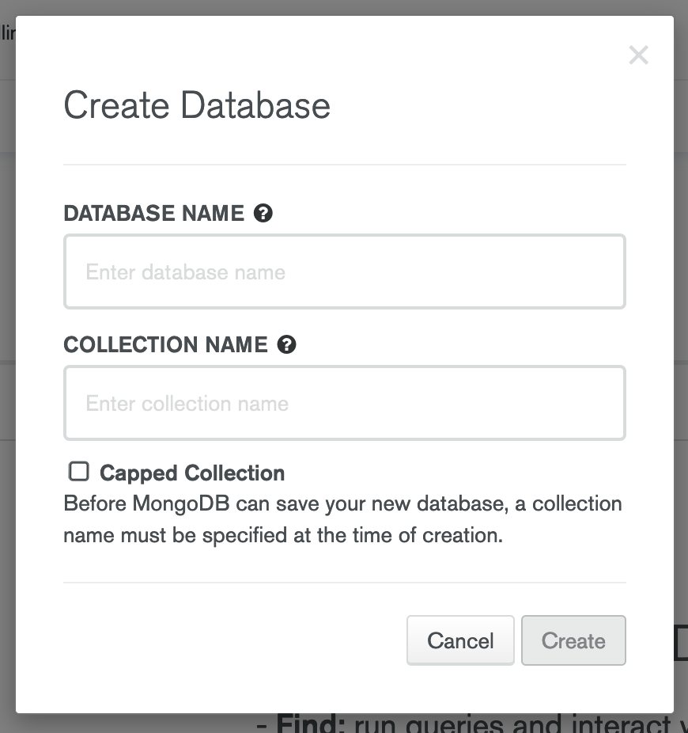

    DatabaseとCollectionの名前を入力する。Createを押すを作成が始まる。

    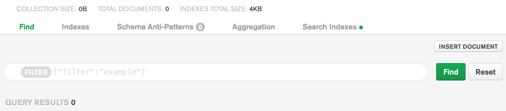

    作成が終わったらFind内にある「Insert document」を押す。

    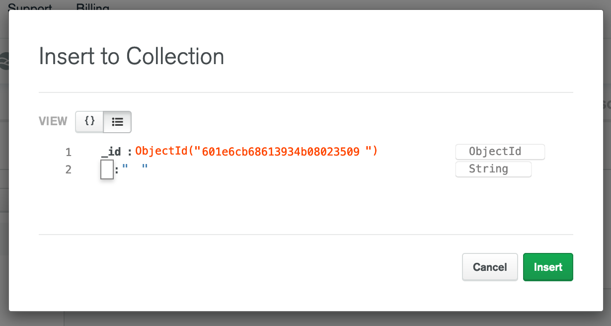
    
    するとドキュメントを記述できる画面が出てくる。
    
    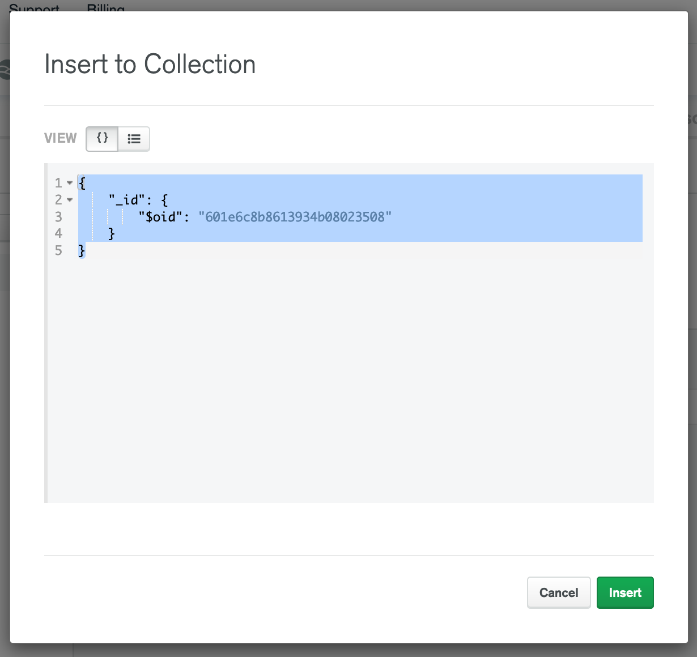
    
    `{}`っぽいボタンを押すと、JSONそのもので記述できるエディタになるので、データ構造がすでに決まっているならこっちからデータを書くのが早いかもしれない。ここでは[Insert Documents](https://docs.mongodb.com/compass/current/documents/insert)のページに記述のあるテストデータをそのままコピペする。もともと記述されているデータはカッコも含めてすべて削除する。入力が完了したらInsertを押す。

    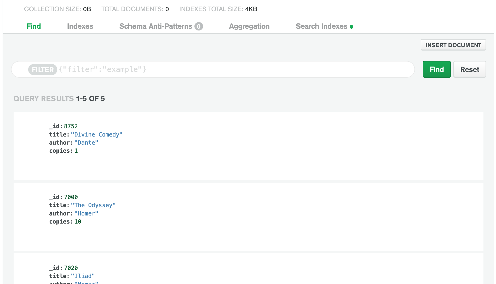

    ドキュメントの格納が完了した。
    
    Atlas側の設定はこれで終わり。

2. Mongooseをインストールする。

    [Mongoose](https://mongoosejs.com/)はJS用のMongoDBアクセスライブラリ。データのアクセスを簡単に実装できる。

    追加したいアプリケーションのフォルダで、`npm i mongoose`を実行してインストールしておく。

3. 

### reference

1. [MongoDB](https://www.mongodb.com/)
2. [MongoDB Atlasを使い始める (MongoDB as a Service) ](https://qiita.com/nacam403/items/08c18a8234c82e2b304e)
3. [80日目：MongoDB AtlasをMongooseにつなげる＆Route Filesを作成](https://ashitamo-net.com/devconnectors-mongodb-mongoose/)
4. [mongoDB Atlas+mongooseでWebアプリをどうやって始めるんや？](https://qiita.com/taro_kawasaki/items/ea8fce2d640e09fea3a9)
5. [MongoDB Atlasに登録して使うまでの手順](https://www.virment.com/how-to-use-mongo-db-atlas/)
6. [MongoDB Atlasで無料で簡単にクラスタ化する](https://qiita.com/ka_nabell_dev/items/0e91ae7646ddc78e514f)
7. [Insert Documents](https://docs.mongodb.com/compass/current/documents/insert)