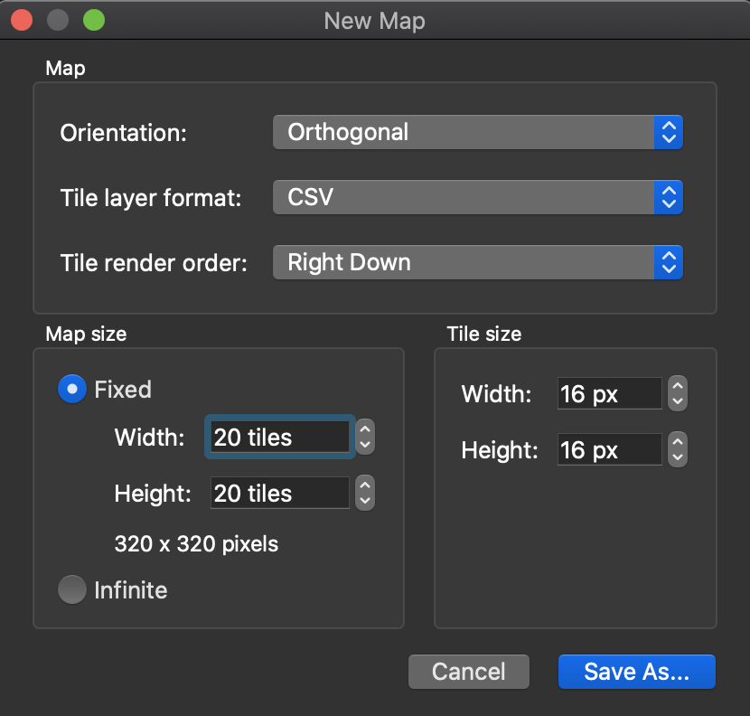

## Tiled Map Editorで作ったJSONのマップをPhaserに取り込む方法

### detail

ゲーム画面の作成には[Tiled Map Editor](https://www.mapeditor.org/)を使っているが、これのPhaserへの取り込みは決まった手順があるのでメモしておく。

#### 大雑把な手順

1. Tiledで新しいMapをJSON形式で作成する。
3. タイルセットのPNGを取り込む。この際、`Embed in map`に**必ずチェックを入れる**こと。
4. 衝突させたいオブジェクトがある場合、`collides`プロパティをbool型でタイルに設定しておく。
5. マップを作成する。
6. Phaser側で作成したJSONファイルとPNGファイルを読み込む。

#### Tiledで新しいMapをJSON形式で作成する


「New Map...」をクリックして新しいマップを作成する。



「Map size」は作りたいマップのサイズを指定する。事前に決まっているサイズがない、とりあえずマップを作りたいという場合は、`infinite`にチェックを入れると、マップサイズの制限なしにマップを生成できる。

「Tile size」はスプライトのサイズを指定する。16x16のスプライトが詰まったスプライトシートを利用する場合、ここに16を縦横にセットする。

「Map」の部分のプロパティは、変更しなくても問題ないはず。

マップは、拡張子を**JSONに設定**して保存する。ファイル名は任意、ファイルの保存先も基本的には任意。ただし、React環境下でPhaserを利用する場合、スプライトシートや音楽などのアセットは`public`フォルダ配下に保存する必要があるので注意。

ファイルが保存できたら、マップの編集画面に遷移する。

#### スプライトシートのPNGを取り込む


マップの編集画面で、「New Tileset...」を押しタイルセットのPNGファイルを取り込む。

なお、PNGファイルはJSONファイルと**同じフォルダに保存しておく**のが良い。一応JSONファイルの中でPNGファイルへのパスが記述されているため、マップを編集している最中は問題にならない。が、この場合あとでweb上へアップロードする際、PNGファイルの置き場所を変えることになるので、結局JSONの内容も書き直すことになる。それなら、最初から同じフォルダに保存しておけばいいよね、という話。


この画面でタイルセットを指定する。この際、`Embed in map`に**必ずチェックを入れる**こと。これを忘れると（一応リカバリーができないわけではないが）、あとでPhaserへ取り込んだときタイルが表示されない症状に悩まされるので注意が必要。

タイルを取り込んだら、マップの編集が可能になる。

なお、ゲーム中で衝突判定させたい場合は、タイルに判定用のプロパティを付与する。ネットによく上がっている記事（[この辺とか](https://medium.com/swlh/grid-based-movement-in-a-top-down-2d-rpg-with-phaser-3-e3a3486eb2fd)）では、判定対象のタイルに`collides`というbool型のプロパティを付与しておく。Phaserに取り込んだ際、このプロパティを元に衝突判定する。

#### マップを作成する

レイヤーを作成してタイルを設定していく。レイヤー名は、あとでPhaserへ取り込む際必要になるので覚えておく。

#### Phaser側で作成したJSONファイルとPNGファイルを読み込む

```typescript
public preload(): void {

    // tilemapTiledJSONでJSONファイルを任意の名前でロードできる。
    // 第1引数に任意の名前、第2引数にJSONファイルを指定する。
    this.load.tilemapTiledJSON('map', 'hoge.json');

    // タイルセットのロードはいつものとおりscene.load.image()を使う。
    this.load.image('mapTiles', 'hoge.png');

}

public create(): void {

    // JSONファイルのマップ情報を追加
    let map = this.add.tilemap('map');

    // PNGファイルのタイルセットを追加。第1引数にタイルセット名、第2引数にタイルセットのimageオブジェクトのキーを指定する
    let tileset = map.addTilesetImage('foo_bar_baz', 'mapTiles');

    // マップの各レイヤーを追加する。第1引数にレイヤー名、第2引数に利用するタイルセットの変数を指定する
    let mapGround = map.createLayer('mapGround', tileset);
    let mapObject = map.createLayer('mapObject', tileset);
    let mapEvent = map.createLayer('mapEvent', tileset);

    // タイルにcollidesという名前で設定した衝突判定用のプロパティを元に、レイヤーごとに判定を追加できる
    mapObject.setCollisionByProperty({ collides: true });
    mapEvent.setCollisionByProperty({ collides: true });

    // 各レイヤー中の衝突判定が可能なオブジェクトにヒットした場合、下記の書き方でコールバック関数を設定できる
    this.physics.add.collider(this.player, mapObject, () => {
        console.log('hit!');
    });

    this.physics.add.collider(this.player, mapEvent, () => {
        console.log('event');
    });
}

```

`preload()`でJSONファイルとPNGファイルをロードし、`create()`でマップを形成する。その際、タイルに設定した衝突判定用のプロパティである`collides`を元に、`setCollisionByProperty()`でタイルに衝突判定を付与できる。衝突判定を付与する方法は[他にもある](https://photonstorm.github.io/phaser3-docs/Phaser.Tilemaps.Tilemap.html)。

ここまで書ければ、ゲームを実行した際にマップが表示されるはず。

なお、マップ上のタイルとプレイヤーで衝突判定を行いたい場合は、プレイヤーに`this.scene.physics.add.existing(this)`している必要がある（ここでの`this`は`Phaser.GameObjects.Sprite`が前提）。つまり、マップ上のオブジェクトとともにプレイヤー側も物理演算の対象としておかないと、マップ上のタイルに衝突判定用のプロパティが設定済みだったとしても、プレイヤー側が衝突判定の対象でなければスルーされてしまう。とくに、移動を**単純にX軸orY軸の値を変化させているだけだと衝突判定の対象外になる**ので注意。衝突判定がしたいなら、移動は`Phaser.Physics.Arcade.Body.setVelocity()`で行う必要がある。

### reference

1. [Grid-Based Movement in a Top-Down 2D RPG With Phaser 3](https://medium.com/swlh/grid-based-movement-in-a-top-down-2d-rpg-with-phaser-3-e3a3486eb2fd)
1. [Tiledで作成したタイルマップjsonファイルをphaser.jsに読み込む方法](https://www.catch.jp/wiki3/tools/phaser_and_tiled)
1. [Using Infinite Maps](https://doc.mapeditor.org/en/stable/manual/using-infinite-maps/)
2. [Phaser 3 Physics for beginners- Endless Bullets](https://phasergames.com/phaser-3-physics-beginners/)
