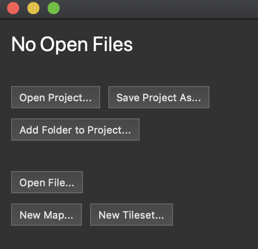
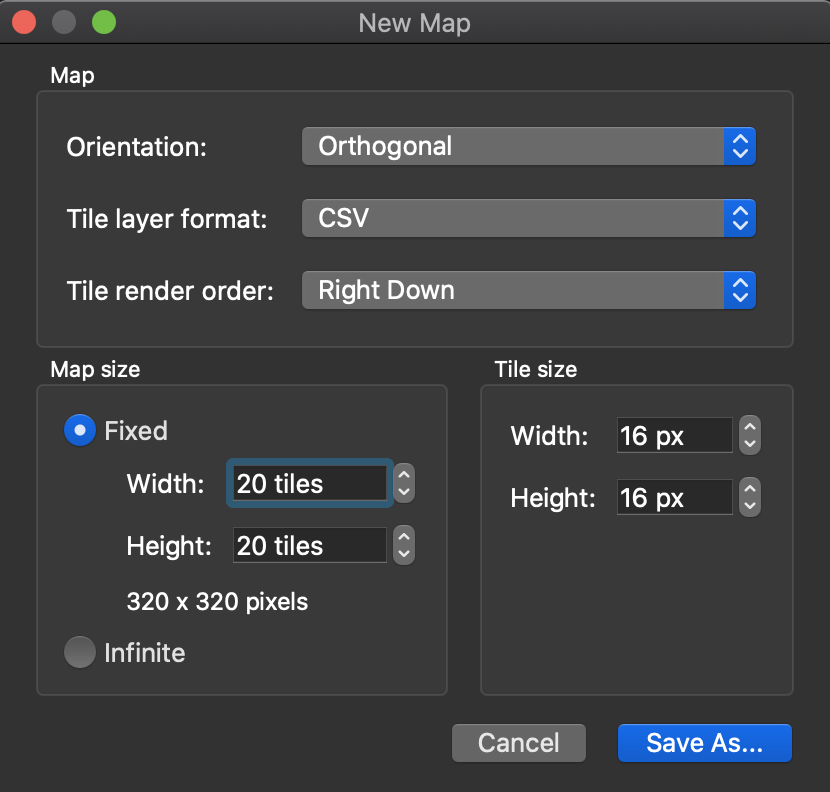
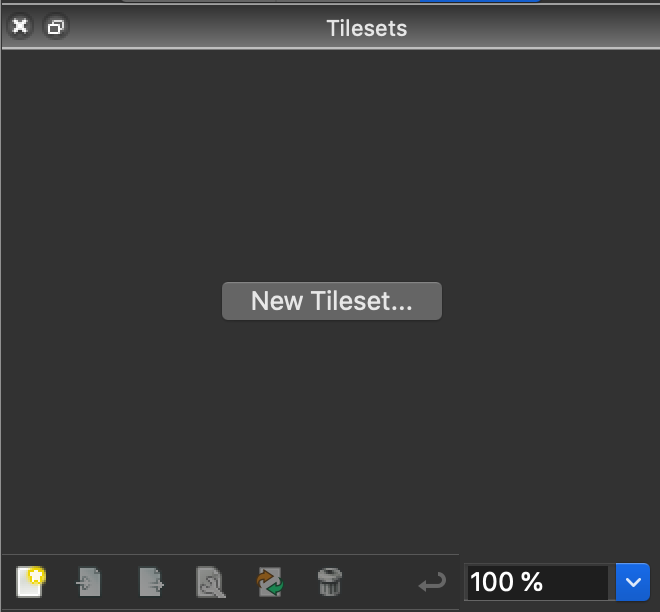
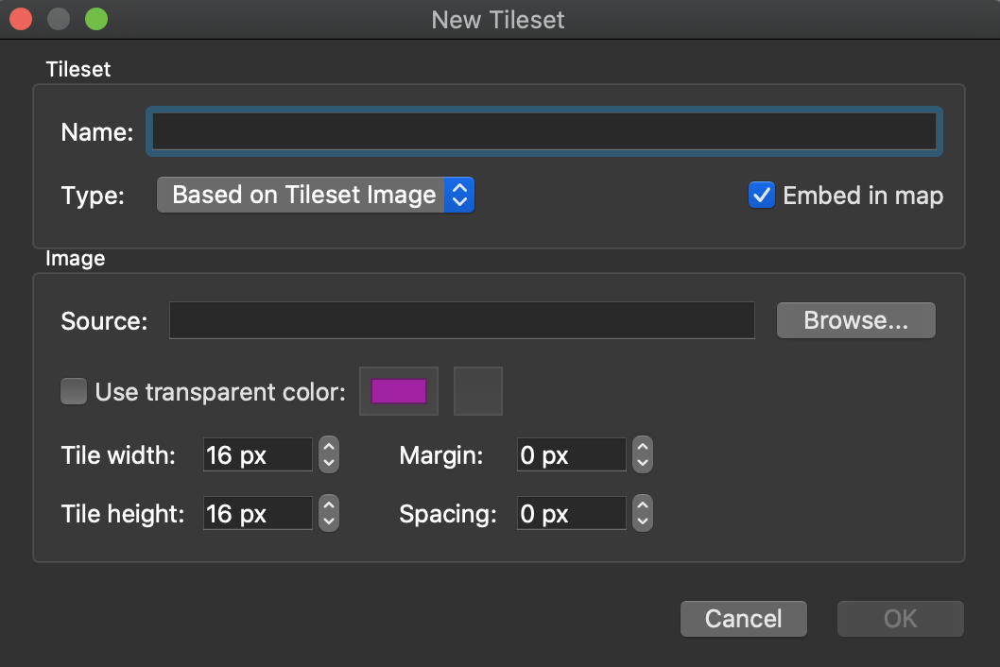

# TIL - PhaserJS

PhaserJSに関することはここに書く。

## Phaserでの基本形

### detail

ES6の形式でPhaserを記述する場合、`class`によるクラスの宣言とPhaserクラスの継承がメインの書き方になる。とくに、Sceneは進行上欠かせない要素なので、`Phaser.Scene`の継承と`super()`によるコンストラクタの記述が必要になると思われる。もうこれは、この形を基本形として覚えてしまってもいいかもしれない。

```javascript
class GameScene extends Phaser.Scene {
    constructor() {
        super('GameScene');
    }

    preload() {

    }

    create() {

        let r1 = this.add.rectangle(200, 200, 100, 150, 0x6666ff);

        this.tweens.add({
        targets: r1,
        scaleX: 0.25,
        scaleY: 0.5,
        yoyo: true,
        repeat: -1,
        ease: 'Sine.easeInOut',
        });

    }
}

let gameScene = new GameScene();

let config = {
    type: Phaser.AUTO,
    width: 800,
    height: 600,
    backgroundColor: '#e0e0e0'
};

let game = new Phaser.Game(config);

game.scene.add('GameScene', gameScene);

game.scene.start('GameScene');
```

この記述内容だと、ただ画面に表示されるだけでそれ以上のことは何もない。ただ、根幹の基本形としてとくにクラスの部分は覚えてしまった方がいいかも。

### reference

1. [Phaser.Scene](https://photonstorm.github.io/phaser3-docs/Phaser.Scene.html)

## オブジェクトの基準点を設定する

### detail

Phaserで利用できるオブジェクトは、デフォルトだと左上が基準点になっている。それを変更したい場合は`setOrigin()`を使う。

- `setOrigin([x], [y])`で水平方向および垂直方向の基準点を変更できる。
- `setOrigin(0.5, 0.5)`とした場合、オブジェクトの中心を基準点として設定する。`setOrigin(1, 1)`の場合は右下が基準点になる。
- 同一アプリケーション内でオブジェクトごとに基準点をそれぞれ変えると、収集がつかなくなると思われるので設定はほどほどに。

### reference

1. [Phaser.GameObjects.Components.Origin](https://photonstorm.github.io/phaser3-docs/Phaser.GameObjects.Components.Origin.html#setOrigin)

## オブジェクトのクラスを継承する

### detail

[Rectangle](https://phaser.io/examples/v3/view/game-objects/shapes/rectangle)などのオブジェクトは、そのクラスを継承して新しいオリジナルのクラスを宣言できる。

```typescript
class RandomRect extends Phaser.GameObjects.Rectangle {
  constructor(scene){
    super(scene, Phaser.Math.Between(0, 700), Phaser.Math.Between(0, 500));
    this.scene.add.existing(this);
    this.width = 100;
    this.height = 100;
    this.setFillStyle(0xff0000);
  }
}

class MainScene extends Phaser.Scene {
  constructor(){
    super('MainScene');
  }
  create(){
    [...Array(10).keys()].forEach(()=>{
      this.hoge = new RandomRect(this);
    });
  }
  update(){
    
  }
}

let mainScene: MainScene = new MainScene();

let config: object = {
    type: Phaser.AUTO,
    width: 800,
    height: 600,
    backgroundColor: '#e0e0e0'
};

let game: Phaser.Game = new Phaser.Game(config);

game.scene.add('MainScene', mainScene);

game.scene.start('MainScene');
```

- `super()`による親コンストラクタが必要になるのは、`Phaser.Scene`クラスの継承と一緒。
- `Phaser.Math.Between()`は、引数に指定した値の間でランダムな値を返す。ここではとりあえず画面内に収まるよう値で、ランダムな位置に四角のオブジェクトを配置している。
- `this.scene.add.existing(this);`とすることで、指定したシーンにオブジェクトを追加する。これがないと、インスタンスが生成されても画面に表示されない。

### reference

1. [Phaser.GameObjects.Rectangle](https://photonstorm.github.io/phaser3-docs/Phaser.GameObjects.Rectangle.html)

## Phaser3用のスプライトシートをJSON付きで作成する

### detail

#### スプライトシートとは

プレイヤーや敵、NPCなどのキャラクターは、モーションを「スプライトシート」というファイルで管理する。スプライトシートとは、コマ割りして描いたモーションの断片をまとめた画像ファイル。このファイルが持つ各モーションの断片を「スプライト」というが、スプライトを短いスパンで同じ場所に連続表示すると、パラパラ漫画と同じ要領で「動いて見える」というわけ。


上記は右方向に歩くモーションを個別に描いてスプライトとし、1つの画像ファイルとしてまとめたもの。これで1つのスプライトシートとなる。もちろん、右方向以外のモーションが描かれていないのでそれらは別途描いてスプライトシートとしてまとめる。問題は描いたスプライトをどうやってまとめて、どうやってゲームエンジン（ここではPhaser3）で利用するか、ということ。

ちなみに当たり前だが、余白部分は透過する必要があるので拡張子はPNGになる。

#### スプライトシートの作り方

スプライトシートはスプライトをまとめたもの。なので、個別の画像を集約して1つの大きな画像にするわけで、普段使っているようなドローソフトで作成自体は可能。

ただし、スプライトシートだけ作った場合は、**単純にスプライトをならべただけの画像ファイル**のなので肝心の「どこの座標にどんなスプライトが描かれているか」という情報がない。プログラミングする段階で座標を都度手動で設定するなら問題ないが、スプライトシートが多くなってくると「ただ座標を延々と設定する作業」が非常に億劫になる。なので、基本的には単純にスプライトシートを作るだけでなく、スプライトの情報が格納されたJSONファイルを同時に作る必要がある。JSONファイルはさすがにドローソフトではどうにもならないので、スプライトシートを作るためのソフトウェアが必要になる。

JSONがエクスポートできるような、スプライトシートの作成方法はいくつか方法がある。

1. [TexturePacker](https://www.codeandweb.com/texturepacker)
   - 多分一番メジャー。
   - 画像の最適化で容量をごっそり削れるので、コンパクトにまとめたいときなどに便利。
   - Phaser3だけでなく、[Cocos2d](https://www.cocos.com/en/)などのさまざまなゲームエンジンに最適化されたファイル形式でエクスポートできる。
   - マルチパックなどいろんな機能もあるのだけど、それらの高機能は**有償版のみ**利用可能。無償版も一応使えるのだがただパッケージ化するだけなので、それだけのためにわざわざインストールするのは面倒。
2. [Free Sprite Sheet Packer](https://www.codeandweb.com/free-sprite-sheet-packer)
   - 上記TexturePackerの無償機能部分だけで構成されたwebApp。
   - TexturePackerをわざわざインストールして無償版で利用するくらいなら、こっちを利用したほうがローカル環境を汚さなくて済むので良い。
3. [Free Tex Packer](https://free-tex-packer.com/app/)
   - インストール不要のwebApp。デスクトップ版もあるが、web版でも欲しい機能はちゃんと実装している。
   - [OSS](https://github.com/odrick/free-tex-packer)なので、何だったらコントリビュートすることも可能。
   - 素晴らしいのは上記TexturePackerの無償版機能にプラスして、各ゲームエンジンに最適化されたJSONをエクスポートできる機能が備わっていること。
   - さらに[TinyPNG](https://tinypng.com/)のデベロッパーキーを持っている場合はTinifyしてロスレス圧縮が可能と、まさに至れり尽くせり。

というわけで、この中ではFree Tex Packerを使うのが正義となる。まぁwebサービスなのでいつなくなるか・・・という不安もあるが。

Free Tex Packerの使い方はUIを見ればわかるので、ここでは詳細に解説はしない。

注意点としては下記の通り。

- エクスポートする際にFormatを「Phaser3」にしておくこと。Phaser3に最適なJSONを出力してくれる。
- Texture Name、File Nameはわかりやすいものに変更しておく。変更しないと、インポートした元画像のファイル名を利用する。
- widthやheightの出力画像サイズを変更する。スプライトの数にも依存するが、ひたすら水平方向あるいは垂直方向に対し、1列にダラダラとスプライトが並んでいるのは見通しが良くない。
- Allow trimはPNGの透過部分を削って、スプライトシートのサイズをなるべく減らすようにスプライトを配置してくれる。スプライトシートが巨大で**なるべく軽量化したいときに使う**。座標はJSONで出力されるので、インポートする際のファイル名管理などがしっかりできていれば問題ないはず。

### reference

1. [Free Tex Packer](http://free-tex-packer.com/)
2. [Pack Sprite sheets for games and sites for free!](https://phaser.io/news/2020/02/free-texture-packer)

## スプライトシートの使い方

### detail

作成したスプライトシートは、シーンにインポートしてアセットとして設定することで、キー入力などのイベントに対し特定のアクションを実行するよう設定できるようになる。

### reference

1. [How to create sprite sheets for Phaser 3 with TexturePacker](https://www.codeandweb.com/texturepacker/tutorials/how-to-create-sprite-sheets-for-phaser3)
2. [Tiled Generated Map with Phaser 3](https://medium.com/@junhongwang/tiled-generated-map-with-phaser-3-d2c16ffe75b6)
3. [Load Atlas With Local Json](https://phaser.io/examples/v3/view/loader/texture-atlas-json/load-atlas-with-local-json#)

## ロードしたオブジェクトのサイズを変更する

### detail

Phaser3で画像のスケールを変更する場合、`scale`を使うと画像のサイズを拡大あるいは縮小できる。もうちょっと正確に言うと、`scale`だと縦横どちらも拡大あるいは縮小する。`scaleX`ならX軸、つまり横方向に拡大あるいは縮小する。`scaleY`ならY軸、つまり縦方向に拡大あるいは縮小する。

```javascript
export class MainScene extends Phaser.Scene {
    constructor() {
        super('mainScene');
    }

    preload() {
        this.load.image('hoge', 'assets/if/hoge.png');
        this.load.image('fuga', 'assets/if/fuga.png');
    }

    create() {

        let hoge = this.add.image(width - 100, height - 100, 'hoge');
        hoge.scale = 2; // 縦横どちらも2倍する

        let fuga = this.add.image(width - 200, height - 200, 'fuga');
        fuga.scaleX = 0.5; // 横方向に縮小する。
        
    }
}
```

上記では`add.image()`したオブジェクトに対して拡大あるいは縮小しているが、`add.sprite()`したオブジェクトでも同様にサイズ変更できる。

### reference

1. [Phaser.GameObjects.Image](https://photonstorm.github.io/phaser3-docs/Phaser.GameObjects.Image.html)
2. [Scaling in phaser3](https://phasergames.com/scaling-in-phaser-3/)

## スプライトシートを使ってアニメーションを構築する

### detail

アセットとして取り込んだスプライトシートを使って、アニメーションを生成してみる。ここではアニメーションを生成して、キー入力に応じて動作するようなロジックを記述する。

```typescript

public preload(): void {
    let load_assets = ['spriteHoge', 'white_and_black'];

    [...load_assets].forEach(asset => {
        let pngPath = 'assets/spritesheet/' + asset + '/' + asset + '.png';
        let jsonPath = 'assets/spritesheet/' + asset + '/' + asset + '.json';
        this.load.atlas(asset, pngPath, jsonPath);
    });


}

public create(): void {
  this.player = this.add.sprite(300, 300, 'spriteHoge', '01_forward_neutral1',);

  this.anims.create({
      key: 'walkFoward', frames: [
          { key: 'spriteHoge', frame: '03_forward_walk1' },
          { key: 'spriteHoge', frame: '02_forward_neutral2' },
          { key: 'spriteHoge', frame: '04_forward_walk2' },
      ], frameRate: 10, repeat: -1
  });

  this.cursors = this.input.keyboard.createCursorKeys();
}
```

まず、スプライトシートを取り込んでオブジェクトを任意の場所に配置しておく。

アニメーションは`scene.anims.create()`で作成する。`key`はアニメーションごとの識別子を、`frames`はアニメーションで利用するフレームを配列で指定する。この配列はオブジェクトを要素とし、`{key: スプライトシート名, frame: スプライト名}`でアニメーションの各フレームを設定できる。`framerate`はアニメーションの速さを設定可能。`repeat`は「-1」に設定すると永久にリピートする。

スプライトとアニメーションの設定はこれだけでよい。

最後の1文は、キーボードの方向キー入力を受け付ける設定。

```typescript
public update(): void {

    if (this.cursors.down.isDown) {
        this.player.anims.play('walkFoward', true);
        this.player.y += 2;
    }

    else {

        this.player.anims.stop();
    }
}

```

キーボード入力に対応してアニメーションさせるには、`update()`関数内でアニメーションを動作させる必要がある。この場合は、トリガーはキー入力になるので、任意のキー入力に対しアニメーションが動作するよう記述してやればいい。`任意のオブジェクト.anims.play()`で指定されたオブジェクトが設定されたアニメーションを実行する。ここでは`this.player`というオブジェクトが、アニメーションしながらY座標を移動する。

キー入力がされていない場合は、`anims.stop()`とすることでアニメーションを中止できる。

上記では1つのアニメーションしか指定していないが、方向キーそれぞれに異なるアニメーションを設定することが可能。

### reference

1. [Animation](https://rexrainbow.github.io/phaser3-rex-notes/docs/site/animation/)
2. [How to create sprite sheets for Phaser 3 with TexturePacker ](https://www.codeandweb.com/texturepacker/tutorials/how-to-create-sprite-sheets-for-phaser3)


## JSON付きスプライトシートの使い方

### detail

ただの画像ファイルをロードし、スプライト扱いで画面に表示させるには下記の方法でいい。

```javascript
preload() {

    this.load.image('beball', 'assets/sprites/beball1.png');
    this.load.image('atari', 'assets/sprites/atari400.png');
    this.load.image('bikkuriman', 'assets/sprites/bikkuriman.png');

}

create() {

    this.add.sprite(200, 300, 'beball');
    this.add.sprite(500, 300, 'atari');
    this.add.sprite(800, 300, 'bikkuriman');

}
```

上記に対し、JSON付きのスプライトシートは、1つの画像ファイルの中にさまざまなスプライトをまとめて格納する。これだけでは1つの画像ファイルとしてしか扱えないので、座標を識別子であるスプライト名などとともに（場合によってはスプライトの大きさまで）記述したJSONを用いて、各スプライトの情報を管理する。この2つのファイルをセットで扱うことで、スプライトを個別にロードする必要がなくなり、スプライトの管理が楽になる。

そんなJSON付きスプライトシートは、上記の通り1つの画像ファイルとしては扱えないので`scene.load.image()`は使えない。

```javascript
preload() {
    this.load.atlas(assetName, pngPath, jsonPath);
}

create() {
    this.add.sprite(200, 200, assetName, spriteName);
}
```

JSON付きスプライトシートは、上記の通り`scene.load.atlas()`を使う。そして、スプライトシートを表示する場合は、`scene.add.sprite()`を利用する。ここで`assetName`はスプライトシートを区別するための文字列なので、わかりやすいものなら何でもいい。問題は`spriteName`の方で、これは**JSONファイル内に記述してあるスプライト名を指定する**必要がある。スプライトシート作成時に各スプライトには何らかの名前をつけているはずなので、それで指定する。場合によっては、このスプライト名が数字などになっている場合がある。その場合は名前を指定してスプライトシートを作成し直すか、JSONファイル内のスプライト名を直接書き換えてわかりやすいものにしておく。

### reference

1. [Multiple Sprites](https://phaser.io/examples/v3/view/game-objects/sprites/multiple-sprites)
1. [Phaser3の豆知識](https://qiita.com/gakuseikai/items/062d2c3d132bf430fcb9)
2. [Phaser3 でスペースを押したときにスプライトが落下するサンプル](https://hawksnowlog.blogspot.com/2018/04/fall-sprites-sample-phaser3.html)

## マップ内にプレイヤーを収める方法について

### detail

プレイヤーのスプライトに対し、キー入力に従って移動するようなロジックを実装したとする。このとき何も設定していないと、Tiledで作ったマップがたとえ100x100のサイズしかなかったとしても、プレイヤーのスプライトはそのサイズに関係なく移動できる。つまり、マップ外に飛び出してしまう。なんなら、ゲーム画面が100x100しかなかったとしても、スプライトはゲーム画面の外（つまり、不可視の部分）にまで行くことが可能なので、結果的にプレイヤーがゲーム画面から消えてしまう。

それを防ぎ、Tiledで作ったマップ内にプレイヤーを収めるための設定が存在する。

```javascript
    this.player = this.physics.add.sprite(300, 100, 'lain_normal', 'forward_neutral1',);

    this.physics.world.bounds.width = mapGround.width;
    this.physics.world.bounds.height = mapGround.height;
    this.player.setCollideWorldBounds(true);
```

`scene.physics.world.bounds`で、ゲーム世界のうち「どこまでを移動可能な範囲にするか」設定できる。ここでは、`mapGround`というTiledで作ったマップの幅と高さを設定している。また、これだけではマップの範囲をゲーム世界の移動可能範囲に指定しただけなので、`this.player.setCollideWorldBounds(true);`でプレイヤーはゲーム世界の移動可能範囲においてのみ行動できるよう設定する。これで、ゲーム世界の外へ飛び出してゲーム画面からプレイヤーがいなくなってしまう事態を避けることができる。

### reference

1. [How to Create a Turn-Based RPG in Phaser 3 – Part 1](https://gamedevacademy.org/how-to-create-a-turn-based-rpg-game-in-phaser-3-part-1/)

## アセット名が重複してしまった場合は先に読み込んだ方が優先される

### detail

別のファイルにおいて、同じ名前で別アセットをロードした場合は、**先にロードされたアセットが優先される**。そのため、後にロードされたアセットは無視されるので、注意が必要。

具体例をあげる。

1. シーンAでMP3ファイル「bgm.mp3」を`bgm`という名前でロードする。
2. シーンBでMP3ファイル「hitSound.mp3」を`bgm`という名前でロードする。
3. シーンAはシーンBよりも先に実行される。
4. シーンBで`bgm`を再生すると、「bgm.mp3」が再生される（本来は「hitSound.mp3」が再生されてほしかった）

とりあえず、これ自体は仕様なので覚えておけばよい。大抵は名称設定を間違っている（先行する別ファイルと同じ名前をつけてしまった）ケースが多い。そのシーンでしか利用しないアセットなら、名前にシーン名をつけてやれば、重複しないはず。上記の例で言えば「sceneABGM」と「sceneBBGM」のように名称設定すればいい。

### reference

1. [なし]()

## 複数のタイルセットから構成される1枚のマップを読み込む方法

### detail

フィールドを作成するとき、複数のタイルセットを使って1枚のタイルマップを作ることがある。この場合、Phaser3でどのようにロードすればいいか。

```typescript
public preload(): void {
    this.load.tilemapTiledJSON('map', 'hoge.json');
    this.load.image('mapTiles', 'hoge.png');
}

public create(): void {

    this.cameras.main.fadeIn(1000, 0, 0, 0);

    let map = this.add.tilemap('map');
    let tileset = map.addTilesetImage('white_and_black', 'mapTiles');
    let mapGround = map.createLayer('mapGround', tileset);
    let mapObject = map.createLayer('mapObject', tileset);
    let mapEvent = map.createLayer('mapEvent', tileset);

    mapObject.setCollisionByProperty({ collides: true });
    mapEvent.setCollisionByProperty({ collides: true });

}

```
1枚のタイルセットから1枚のタイルマップを作成した場合は、上記のようにロードする。

```typescript
public preload(): void {

    this.load.tilemapTiledJSON('map', 'hoge.json');
    this.load.image('hoge1', 'hoge1.png');
    this.load.image('hoge2', 'hoge2.png');
    this.load.image('hoge3', 'hoge3.png');
    this.load.image('hoge4', 'hgoe4.png');

}

public create(): void {

    let map = this.add.tilemap('map');

    let allTileLayers: Phaser.Tilemaps.Tileset[] = [];

    ['hgoe1', 'hoge2', 'hoge3', 'hoge4'].forEach(tile => {
        allTileLayers.push(map.addTilesetImage(tile, tile));
    });
    
    let mapGround = map.createLayer('mapRoomFloor', allTileLayers);
    let mapWalls = map.createLayer('mapRoomWalls', allTileLayers);
    let mapObject = map.createLayer('mapRoomObject', allTileLayers);
    let mapObject2 = map.createLayer('mapRoomObject2', allTileLayers);
    let mapEvent = map.createLayer('mapRoomEvent', allTileLayers);

}
```

複数のタイルセットから構成される1枚のタイルマップのロードは、上記のように**タイルセットの配列**を使う。`addTilesetImage()`したタイルセットを配列にセットすることで、1つのタイルセットとして扱えるようになる。


### reference

1. [Multiple tilesets in a single Tiled layer?](https://www.html5gamedevs.com/topic/36520-multiple-tilesets-in-a-single-tiled-layer/)

## 音声素材やBGMをロードして再生する

### detail

ボタンを押したときの効果音やBGMなどは、音声のアセットとして同じようなコードで実装が可能。

```typescript
preload() {
    this.load.audio('whiteNoise', 'whiteNoise.mp3');
    this.load.audio('buttonSound', './assets/sound/button/button_ok.mp3');
}

create(){
    let buttonSound = this.sound.add('buttonSound');
    
    let whiteNoise = this.sound.add('whiteNoise', { loop: true });
    whiteNoise.play();

    const { width, height } = this.game.canvas;

    const zone = this.add.zone(width / 2, height / 2, width, height);

    zone.setInteractive({
        useHandCursor: true
    });

    zone.on('pointerdown', () => {
        buttonSound.play();
    });

}
```

まず`preload()`内で、`scene.load.audio()`を使い音声ファイルをロードする。次に`create()`内で`scene.sound.add()`を実行し、シーンに音声ファイルを追加する。あとは再生したいタイミングのコード部分で`play()`を実行すればいい。

`loop`プロパティをtrueにするとループ再生される。

Phaser3自身が対応している再生可能な音声ファイルは`*.wav`や`*.mp3`、`*.ogg`がある。ただ、`*.ogg`はブラウザ側が対応していない事が多く、Safariは未対応だったりする。そのため、基本的にはファイルサイズ的にも`*.mp3`を利用することになると思う。ただし、[MP3はエンコード時に無音部分が必ず挿入されるため完全なループ素材とすることが難しい](https://ameblo.jp/djdaishizen/entry-11996902609.html)せいもあり、完璧なループ素材としたい場合は`*.wav`一択になる。

### reference

1. [Audio](https://rexrainbow.github.io/phaser3-rex-notes/docs/site/audio/)
2. [mp3に変換すると無音部分ができてしまう理由](https://ameblo.jp/djdaishizen/entry-11996902609.html)

## ボタンのクラスを作成する方法

## detail

任意の文字列と押されたときの挙動を書いたコールバック関数などを受け取って、画面にボタンを配置するクラスを作った。

```typescript
type Props = {
  width: number;
  height: number;
  onClick: Function;
  align: string;
  fontSize: number;
  color: string;
}

class OriginalButtonClass extends Phaser.GameObjects.Container{
  
  text: Phaser.GameObjects.Text;
  container: Phaser.GameObjects.Rectangle;
  
  constructor (scene: Phaser.Scene, x:number, y:number, text:string, props: Props){
    super(scene, x, y);
    
    const{
      width = 90,
      height = 40, 
      onClick,
      align = 'center', 
      fontSize = 30, 
      color = 'black'
    } = props;
    
    this.scene = scene;
    this.scene.add.existing(this);
    
    this.setSize(width, height);
    this.setInteractive({useHandCursor: true});
    
    const alignLeft = align === 'left';
    
    this.text = scene.add.text(alignLeft ? -width / 2 + 0 : 0, -1, text, {align, fontSize, color}).setOrigin(alignLeft ? 0:0.5, 0.5).setPadding(0, 2, 0, 0);
    this.text.setColor(color);
    
    this.container = scene.add.rectangle(0, 0, width, height);
    this.container.setStrokeStyle(1, 0xffffff).setOrigin(alignLeft ? 0 : 0.5, 0.5);
    
    this.add([this.container, this.text])
    this.on('pointerover', () => {
      this.updateButton('pointer over', 'red');
    });
    
    this.on('pointerout', () => {
      this.updateButton('pointer out', color);
    });
    
    this.on('pointerdown', ()=>{
      this.updateButton('pointer down', 'blue');
      this.scene.tweens.add({
        targets: this,
        scaleX: 1.1,
        scaleY: 1.1,
        duration: 100,
        yoyo: true,
        repeat: 2,
        ease: 'Sine.easeInOut',
      });
    });
    
    this.on('pointerup', () => {
      this.updateButton('pointer up','yellow');
      onClick();
    });
    
  }
  
  updateButton =(message: string, color: string)=>{
    console.log(message);
    this.text.setColor(color);
  }

}

class GameScene extends Phaser.Scene {
    constructor() {
        super('gameScene');
    }

    preload() {

    }

    create() {
      this.button = new OriginalButtonClass(this, 200, 200, 'hoge', {
        onClick: ()=>{
          console.log('clicked.');
        }
      });

    }
}

let gameScene = new GameScene();

let config = {
    type: Phaser.AUTO,
    width: 800,
    height: 600,
    backgroundColor: '#e0e0e0'
};

let game = new Phaser.Game(config);

game.scene.add('gameScene', gameScene);

game.scene.start('gameScene');
```

クリックしたときのTweenも設定してみた。

ボタンを押したときの機能は関数で渡すので、ボタンのクラス内には特段の機能は記述していない。必要があれば追記するか、このクラスを継承すればいい。

## reference

1. [Buttons In Phaser 3](https://snowbillr.github.io/blog/2018-07-03-buttons-in-phaser-3/)
2. [Phaser3でボタンクラスを作る](https://qiita.com/S-Kaito/items/85a1c90c86e61156c87d)

## PhaserにTwitterへのシェアボタンを追加する

### detail

よくキャンペーンサイトとかでTwitterにシェアするためのボタンがあるけど、あれはTwitterに対してパラメータを仕込んだURLを渡すことで任意のツイートを生成するように実装できる。ボタンを押したときのイベントにコールバック関数を指定し、そのコールバック関数の中でURLを指定すればいい。

> http://twitter.com/share?url=[シェアするURL]&text=[ツイート内テキスト]&via=[ツイート内に含むユーザ名]&related=[ツイート後に表示されるユーザー]&hashtags=[ハッシュタグ]

ハッシュタグを生成できる`hashtags`は、カンマで区切ることで複数のハッシュタグを指定できる。これらの内容以外に`in-reply-to`でリプライ先を指定できるっぽいが、シェアに使うURLなので任意の誰かにリプライするケースはあまり想像つかないな。

```typescript
type Props = {
  width: number;
  height: number;
  onClick: Function;
  align: string;
  fontSize: number;
  color: string;
}

class OriginalButtonClass extends Phaser.GameObjects.Container{
  
  text: Phaser.GameObjects.Text;
  container: Phaser.GameObjects.Rectangle;
  
  constructor (scene: Phaser.Scene, x:number, y:number, text:string, props: Props){
    super(scene, x, y);
    
    const{
      width = 90,
      height = 40, 
      onClick,
      align = 'center', 
      fontSize = 30, 
      color = 'black'
    } = props;
    
    this.scene = scene;
    this.scene.add.existing(this);
    
    this.setSize(width, height);
    this.setInteractive({useHandCursor: true});
    
    const alignLeft = align === 'left';
    
    this.text = scene.add.text(alignLeft ? -width / 2 + 0 : 0, -1, text, {align, fontSize, color}).setOrigin(alignLeft ? 0:0.5, 0.5).setPadding(0, 2, 0, 0);
    this.text.setColor(color);
    
    this.container = scene.add.rectangle(0, 0, width, height);
    this.container.setStrokeStyle(1, 0xffffff).setOrigin(alignLeft ? 0 : 0.5, 0.5);
    
    this.add([this.container, this.text])
    this.on('pointerover', () => {
      this.updateButton('pointer over', 'red');
    });
    
    this.on('pointerout', () => {
      this.updateButton('pointer out', color);
    });
    
    this.on('pointerdown', ()=>{
      this.updateButton('pointer down', 'blue');
      this.scene.tweens.add({
        targets: this,
        scaleX: 1.1,
        scaleY: 1.1,
        duration: 100,
        yoyo: true,
        repeat: 2,
        ease: 'Sine.easeInOut',
      });
    });
    
    this.on('pointerup', () => {
      this.updateButton('pointer up','yellow');
      onClick();
    });
    
  }
  
  updateButton =(message: string, color: string)=>{
    console.log(message);
    this.text.setColor(color);
  }

}

class GameScene extends Phaser.Scene {
    constructor() {
        super('gameScene');
    }

    preload() {

    }

    create() {
      this.button = new OriginalButtonClass(this, 200, 200, 'hoge', {
        onClick: ()=>{
          // console.log('clicked.');
          window.open('http://twitter.com/share?url=https://www.example.com&text=hoge, fuga and piyo!ほげ、ふが、ピ夜！？&hashtags=hogehoge,fugafuga,piyopiyo');
        }
      });

    }
}

let gameScene = new GameScene();

let config = {
    type: Phaser.AUTO,
    width: 800,
    height: 600,
    backgroundColor: '#e0e0e0'
};

let game = new Phaser.Game(config);

game.scene.add('gameScene', gameScene);

game.scene.start('gameScene');

```

この前作ったボタンクラスのソースをちょっとだけ改変して、Twitterにシェアするボタンにしてみた。

```typescript
window.open('http://twitter.com/share?url=https://www.example.com&text=hoge, fuga and piyo!ほげ、ふが、ピ夜！？&hashtags=hogehoge,fugafuga,piyopiyo');
```

`window.open()`で指定したURLを開ける。ちなみに、これ自体はURLなのでテキストを入力する際にはクォーテーションなどで括ってはいけない。

### reference

1. [Web Intents](https://developer.twitter.com/en/docs/twitter-for-websites/web-intents/overview)
3. [Twitter シェアボタンの設置方法](https://note.com/ytk141/n/nc76dd06aaff4)
1. [Open url in a new new tab Safari](https://www.html5gamedevs.com/topic/40065-open-url-in-a-new-new-tab-safari/)
2. [Sharing a URL with a query string on Twitter](https://stackoverflow.com/questions/6208363/sharing-a-url-with-a-query-string-on-twitter)

## ローディングシーンを追加するメモ

### detail

今の実装してないので、メモだけ。

### reference

1. [Creating a Preloading Screen in Phaser 3](https://gamedevacademy.org/creating-a-preloading-screen-in-phaser-3/)

## Tiled Map Editorで作ったJSONのマップをPhaserに取り込む方法

### detail

ゲーム画面の作成には[Tiled Map Editor](https://www.mapeditor.org/)を使っているが、これのPhaserへの取り込みは決まった手順があるのでメモしておく。

#### 大雑把な手順

1. Tiledで新しいMapをJSON形式で作成する。
3. タイルセットのPNGを取り込む。この際、`Embed in map`に**必ずチェックを入れる**こと。
4. 衝突させたいオブジェクトがある場合、`collides`プロパティをbool型でタイルに設定しておく。
5. マップを作成する。
6. Phaser側で作成したJSONファイルとPNGファイルを読み込む。

#### Tiledで新しいMapをJSON形式で作成する



「New Map...」をクリックして新しいマップを作成する。



「Map size」は作りたいマップのサイズを指定する。事前に決まっているサイズがない、とりあえずマップを作りたいという場合は、`infinite`にチェックを入れると、マップサイズの制限なしにマップを生成できる。

「Tile size」はスプライトのサイズを指定する。16x16のスプライトが詰まったスプライトシートを利用する場合、ここに16を縦横にセットする。

「Map」の部分のプロパティは、変更しなくても問題ないはず。

マップは、拡張子を**JSONに設定**して保存する。ファイル名は任意、ファイルの保存先も基本的には任意。ただし、React環境下でPhaserを利用する場合、スプライトシートや音楽などのアセットは`public`フォルダ配下に保存する必要があるので注意。

ファイルが保存できたら、マップの編集画面に遷移する。

#### スプライトシートのPNGを取り込む



マップの編集画面で、「New Tileset...」を押しタイルセットのPNGファイルを取り込む。

なお、PNGファイルはJSONファイルと**同じフォルダに保存しておく**のが良い。一応JSONファイルの中でPNGファイルへのパスが記述されているため、マップを編集している最中は問題にならない。が、この場合あとでweb上へアップロードする際、PNGファイルの置き場所を変えることになるので、結局JSONの内容も書き直すことになる。それなら、最初から同じフォルダに保存しておけばいいよね、という話。



この画面でタイルセットを指定する。この際、`Embed in map`に**必ずチェックを入れる**こと。これを忘れると（一応リカバリーができないわけではないが）、あとでPhaserへ取り込んだときタイルが表示されない症状に悩まされるので注意が必要。

タイルを取り込んだら、マップの編集が可能になる。

なお、ゲーム中で衝突判定させたい場合は、タイルに判定用のプロパティを付与する。ネットによく上がっている記事（[この辺とか](https://medium.com/swlh/grid-based-movement-in-a-top-down-2d-rpg-with-phaser-3-e3a3486eb2fd)）では、判定対象のタイルに`collides`というbool型のプロパティを付与しておく。Phaserに取り込んだ際、このプロパティを元に衝突判定する。

#### マップを作成する

レイヤーを作成してタイルを設定していく。レイヤー名は、あとでPhaserへ取り込む際必要になるので覚えておく。

#### Phaser側で作成したJSONファイルとPNGファイルを読み込む

```typescript
public preload(): void {

    // tilemapTiledJSONでJSONファイルを任意の名前でロードできる。
    // 第1引数に任意の名前、第2引数にJSONファイルを指定する。
    this.load.tilemapTiledJSON('map', 'hoge.json');

    // タイルセットのロードはいつものとおりscene.load.image()を使う。
    this.load.image('mapTiles', 'hoge.png');

}

public create(): void {

    // JSONファイルのマップ情報を追加
    let map = this.add.tilemap('map');

    // PNGファイルのタイルセットを追加。第1引数にタイルセット名、第2引数にタイルセットのimageオブジェクトのキーを指定する
    let tileset = map.addTilesetImage('foo_bar_baz', 'mapTiles');

    // マップの各レイヤーを追加する。第1引数にレイヤー名、第2引数に利用するタイルセットの変数を指定する
    let mapGround = map.createLayer('mapGround', tileset);
    let mapObject = map.createLayer('mapObject', tileset);
    let mapEvent = map.createLayer('mapEvent', tileset);

    // タイルにcollidesという名前で設定した衝突判定用のプロパティを元に、レイヤーごとに判定を追加できる
    mapObject.setCollisionByProperty({ collides: true });
    mapEvent.setCollisionByProperty({ collides: true });

    // 各レイヤー中の衝突判定が可能なオブジェクトにヒットした場合、下記の書き方でコールバック関数を設定できる
    this.physics.add.collider(this.player, mapObject, () => {
        console.log('hit!');
    });

    this.physics.add.collider(this.player, mapEvent, () => {
        console.log('event');
    });
}

```

`preload()`でJSONファイルとPNGファイルをロードし、`create()`でマップを形成する。その際、タイルに設定した衝突判定用のプロパティである`collides`を元に、`setCollisionByProperty()`でタイルに衝突判定を付与できる。衝突判定を付与する方法は[他にもある](https://photonstorm.github.io/phaser3-docs/Phaser.Tilemaps.Tilemap.html)。

ここまで書ければ、ゲームを実行した際にマップが表示されるはず。

なお、マップ上のタイルとプレイヤーで衝突判定を行いたい場合は、プレイヤーに`this.scene.physics.add.existing(this)`している必要がある（ここでの`this`は`Phaser.GameObjects.Sprite`が前提）。つまり、マップ上のオブジェクトとともにプレイヤー側も物理演算の対象としておかないと、マップ上のタイルに衝突判定用のプロパティが設定済みだったとしても、プレイヤー側が衝突判定の対象でなければスルーされてしまう。とくに、移動を**単純にX軸orY軸の値を変化させているだけだと衝突判定の対象外になる**ので注意。衝突判定がしたいなら、移動は`Phaser.Physics.Arcade.Body.setVelocity()`で行う必要がある。

### reference

1. [Grid-Based Movement in a Top-Down 2D RPG With Phaser 3](https://medium.com/swlh/grid-based-movement-in-a-top-down-2d-rpg-with-phaser-3-e3a3486eb2fd)
1. [Tiledで作成したタイルマップjsonファイルをphaser.jsに読み込む方法](https://www.catch.jp/wiki3/tools/phaser_and_tiled)
1. [Using Infinite Maps](https://doc.mapeditor.org/en/stable/manual/using-infinite-maps/)
2. [Phaser 3 Physics for beginners- Endless Bullets](https://phasergames.com/phaser-3-physics-beginners/)

## タイマーを設定する方法

### detail

`Phaser.Time.Clock`クラスを利用することで、時限式のイベントを仕込むことが可能。

```typescript
class GameScene extends Phaser.Scene {
    timerRepeat: Phaser.Time.Clock;
    timerLoop: Phaser.Time.Clock;
    timerOneShot: Phaser.Time.Clock;
  
    constructor() {
        super('gameScene');
    }

    preload() {

    }

    create() {
      this.timerRepeat = this.time.addEvent({
        delay: 1000,
        callback: ()=>console.log('hoge'),
        callbackScope: this,
        repeat: 2,
      });

      this.timerLoop = this.time.addEvent({
        delay: 2000,
        callback: ()=>console.log('loop'),
        callbackScope: this,
        loop: true,
      });

      this.timerOneShot = this.time.delayedCall(3000, ()=>console.log('one shot'), this
      );

    }
}

let gameScene = new GameScene();

let config = {
    type: Phaser.AUTO,
    width: 800,
    height: 600,
    backgroundColor: '#e0e0e0'
};

let game = new Phaser.Game(config);

game.scene.add('gameScene', gameScene);

game.scene.start('gameScene');
```

`addEvent()`では、引数にタイマーの設定を記述したオブジェクトを渡す。`loop:true`にすれば延々とループするし、`repeat:n`とすればn+1回リピートする。なぜ1回足されるかというと、0回目からスタートするようで、`repeat:2`と指定した場合は合計で3回コールバック関数が実行される。`repeat:0`とした場合は1回のみの実行で終了、つまり単発の実行と同じになる。単発で実行する場合は`delayedCall()`で実装することも可能。こちらは、引数にオブジェクトではなく経過時間、コールバック関数、コールバックのスコープなどを指定する。設定した時間が経過すると、1度だけコールバック関数が実行される。

### reference

1. [Phaser.Time. Clock](https://photonstorm.github.io/phaser3-docs/Phaser.Time.Clock.html)
2. [Timer](https://rexrainbow.github.io/phaser3-rex-notes/docs/site/timer/)

## 視差を利用した背景イメージを表示する

### detail

webページのデザインにParallaxというものがある。Parallaxとは「視差」を意味していて、部分ごとに動くスピードや方向に差をつけるようなデザインのこと。これをPhaserで表現する。

もう少し詳しく言うと、たとえば横スクロールアクションゲームにおいて、「超遠い位置にある太陽の位置はプレイヤーに関わらずスクロールしない」けど、「中間に位置する山はプレイヤーの移動速度の半分でスクロールする」し、「手前に位置する地面やブロックなどのオブジェクトはプレイヤーとほぼ変わらない速度でスクロールする」というように、レイヤーやオブジェクトごとに移動速度を個別に設定する。このように移動速度に差を施すことで、Parallaxつまり視差を実現し奥行きを表現する。

じゃあ、どうやって移動速度に差を施すかというと、**それ用のメソッドが用意されている**。

```typescript
this.add.image(0, 0, 'backgroundImage').setOrigin(0.5, 0.5).setScrollFactor(0.25);
```

`setScrollFactor(0.25)`の部分がまさにそれで、引数に本来の移動速度とどのくらい差をつけるか、小数で指定する。

背景画像に対しこのメソッドを使って1を指定した場合、カメラの動きと完全に同期する。つまり、プレイヤーをカメラが追うなら、プレイヤーと完全に同期して背景画像もスクロールする。一切の視差がない、ということだ。対して、0を指定した場合はカメラが動いても追随しない。まったく変わらない（変えたくない）風景なら0を設定する。

たとえば最背面に位置する背景画像には`setScrollFactor(0)`、奥から2番目の風景画像には`setScrollFactor(0.25)`、奥から3番目の背景画像には`setScrollFactor(0.5)`とすると、背景画像ごとに視差を個別に設定できる。これで、奥行き感を表現可能だ。

### reference

1. [Phaser.GameObjects.Components. ScrollFactor ](https://photonstorm.github.io/phaser3-docs/Phaser.GameObjects.Components.ScrollFactor.html#setScrollFactor__anchor)
1. [Add Pizazz with Parallax Scrolling in Phaser 3](https://blog.ourcade.co/posts/2020/add-pizazz-parallax-scrolling-phaser-3/)

## 角の丸い四角を描画するには`fillRoundedRect()``strokeRoundedRect()`を使う

### detail

`rectangle`だと単純な長方形だがそれでは味気ない、というときに使えるのが角の丸い長方形。これは`Phaser.GameObjects.Graphics.fillRoundedRect()`と`strokeRoundedRect()`を利用することで、描画が可能になる。`fill〜`の方が塗りつぶされた長方形、`stroke〜`の方が線のみで塗りつぶしなしの長方形を描画する。

```javascript
graphics = this.add.graphics();

graphics.fillStyle(0xffff00, 1);

//  32px radius on the corners
graphics.fillRoundedRect(32, 32, 300, 200, 32);
```

`rectangle()`は`Shape`クラス配下だが、`fillRoundedRect()`は`Graphics`クラス配下で、扱いも`Shape`クラスとは若干異なる。

1. `fillRoundedRect()`の引数に塗りつぶしの色を指定する項目がない。
3. 第5引数は角の丸み（ラジアン）を調節する引数で、若い数字ほどただの長方形に近づく。
4. 角の丸み（ラジアン）は四隅それぞれで個別に設定可能。

塗りつぶしの色を引数で指定できないので、描画する前に`graphics.fillStyle(カラーコード, アルファ値);`で指定する必要がある。コレがないと、描画されない（内部では描画されているかもしれないが表示されない）ので注意。ちなみに`strokeRoundedRect()`の書式を設定する場合は、`lineStyle(線の太さ、カラーコード、アルファ値)`を利用する。

角の丸みはオプション扱いなので指定する必要はない。小さい長方形を描画する際、デフォルト設定だときれいな長方形にならない（蝶のように中心が凹んでしまう）ので、そういう場合のみ調節すればいいだろう。

```javascript
graphics.fillRoundedRect(360, 240, 400, 300, { tl: 64, tr: 22, bl: 12, br: 0 });
```

角の丸みは一律同じ値を設定することも可能だが、`{ tl: 1, tr: 2, bl: 3, br: 4 }`というように`Top-Left`・`Top-Right`・`Bottom-Left`・`Bottom-Right`をまとめたオブジェクトとして渡す事が可能。これにより、角の丸みを個別に設定できる。

### reference

1. [Phaser.GameObjects. Graphics](https://photonstorm.github.io/phaser3-docs/Phaser.GameObjects.Graphics.html#fillRoundedRect__anchor)
2. [Fill Rounded Rectangle](https://www.phaser.io/examples/v3/view/game-objects/graphics/fill-rounded-rectangle)

## 複数のオブジェクトを管理するにはContainerオブジェクトを利用する

### detail

スプライトやその他のゲームオブジェクトを複数配置した際、これらを1つのオブジェクトとして管理したい場合にContainerオブジェクトにまとめる方法がある。たとえばアイテム画面などで、左側にカテゴリの一覧を表示し、右側に各カテゴリのアイテムを個数とともに表示し、その下側に選択したアイテムの説明を表示するという画面を作るとする。この場合、カテゴリ・アイテム・説明の各欄は別に管理するよりまとめて1つのオブジェクト「アイテムメニュー」として管理した方が、メニュー画面を生成するのも破棄するのも個別に実行する必要がないので簡単。

ここでは、`Container`オブジェクトへの子要素登録と破棄方法について記述する。

```typescript
class Rectangles extends Phaser.GameObjects.Container{
  constructor(scene){
    super(scene);
    
    this.scene = scene;
    this.scene.add.existing(this);
    
    const {width, height} = this.scene.game.canvas;
    
    const margin = 10;
    let background = this.scene.add.rectangle(0 + margin, 0 + margin, width - margin, height - margin, 0x111111);
    background.setOrigin(0, 0);
    
    this.add(background); // add gameobject to container
    
    let recs = [];
    let ellipses = [];
    
    for (let i=0; i<10; i++){
      
      let rec = this.scene.add.rectangle(Phaser.Math.Between(0, width), Phaser.Math.Between(0, height), 100, 100, 0x542342);
      rec.setOrigin(0, 0);
      recs.push(rec);
      
      let ellipse = this.scene.add.ellipse(Phaser.Math.Between(0, width), Phaser.Math.Between(0, height), 100, 100, 0x12a797);
      ellipse.setOrigin(0, 0);
      ellipse.setInteractive();
      ellipse.on('pointerdown', ()=>{
        ellipse.input.enabled = false;
        // ellipse.setVisible(false);
        ellipse.destroy();
      });
      ellipses.push(ellipse);
      
    }
     
    this.add(recs); // add rectangles to container
    this.add(ellipses);
    
    this.timerOneShot = this.scene.time.delayedCall(5000, ()=>{
      console.log(ellipses.length);
      this.destroy();
    }, this);
    
  }
    
}

class GameScene extends Phaser.Scene {
    constructor() {
        super('GameScene');
    }

    preload() {

    }

    create() {

      this.container = new Rectangles(this);
      
    }
  
  update(){
    
  }
  
}

let gameScene = new GameScene();

let config = {
    type: Phaser.AUTO,
    width: 800,
    height: 600,
    backgroundColor: '#e0e0e0'
};

let game = new Phaser.Game(config);

game.scene.add('GameScene', gameScene);

game.scene.start('GameScene');

```

上記のコードは、実行すると円と四角を10個ランダムな位置に生成する。生成から5秒後、背景の四角を含んで画面上のオブジェクトが消失する。この際、画面からオブジェクトを消す処理をしているのは、複数のゲームオブジェクトを個別に削除しているわけではなく、それらを登録したコンテナを削除する処理を**1回だけ実行している**。複数のオブジェクトをコンテナに登録することで、削除する際はコンテナを1回破棄すればいいのでオブジェクトの管理が楽になる。

コンテナへゲームオブジェクトを登録するには、まずゲームオブジェクトをシーンに対して生成してから`add()`を実行する。上記だと`this.add(background);`などがその処理に当たる。引数は単一のオブジェクトに限らず、配列を渡してもよい。これでコンテナにゲームオブジェクトが登録できるので、コンテナに対し`destroy()`を実行してコンテナを破棄すると、登録済みのゲームオブジェクトも一緒に破棄できる。

また、円のオブジェクトはコンテナを破棄するタイミングまでクリックを受け付けており、クリックされると画面から消える。これは**個別のオブジェクトに対し実行している**のが前述のコンテナの処理と異なるところ。どちらも`destroy()`というメソッドを実行することで実装できる。

### reference

1. [Phaser.GameObjects.Container](https://photonstorm.github.io/phaser3-docs/Phaser.GameObjects.Container.html)
2. [Phaser.GameObjects.Rectangle](https://photonstorm.github.io/phaser3-docs/Phaser.GameObjects.Rectangle.html)
3. [Phaser.Input.InputPlugin](https://photonstorm.github.io/phaser3-docs/Phaser.Input.InputPlugin.html)
4. [Registry Data Exchange Es6](https://phaser.io/examples/v3/view/scenes/registry-data-exchange-es6)
   ちなみにこのサンプルはなにか挙動がおかしくて、「赤いオブジェクトをクリックしたらペナルティ」なはずなのだが、ペナルティの処理が正常に動作しておらず通常と同じく得点として処理されている。
6. [setInteractive() on a whole group](https://www.html5gamedevs.com/topic/36248-setinteractive-on-a-whole-group/)
