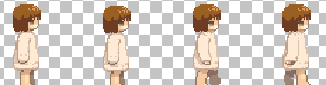

# TIL - PhaserJS

PhaserJSに関することはここに書く。

## Phaserでの基本形

### detail

ES6の形式でPhaserを記述する場合、`class`によるクラスの宣言とPhaserクラスの継承がメインの書き方になる。とくに、Sceneは進行上欠かせない要素なので、`Phaser.Scene`の継承と`super()`によるコンストラクタの記述が必要になると思われる。もうこれは、この形を基本形として覚えてしまってもいいかもしれない。

```javascript
class GameScene extends Phaser.Scene {
    constructor() {
        super('GameScene');
    }

    preload() {

    }

    create() {

        let r1 = this.add.rectangle(200, 200, 100, 150, 0x6666ff);

        this.tweens.add({
        targets: r1,
        scaleX: 0.25,
        scaleY: 0.5,
        yoyo: true,
        repeat: -1,
        ease: 'Sine.easeInOut',
        });

    }
}

let gameScene = new GameScene();

let config = {
    type: Phaser.AUTO,
    width: 800,
    height: 600,
    backgroundColor: '#e0e0e0'
};

let game = new Phaser.Game(config);

game.scene.add('GameScene', gameScene);

game.scene.start('GameScene');
```

この記述内容だと、ただ画面に表示されるだけでそれ以上のことは何もない。ただ、根幹の基本形としてとくにクラスの部分は覚えてしまった方がいいかも。

### reference

1. [Phaser.Scene](https://photonstorm.github.io/phaser3-docs/Phaser.Scene.html)

## オブジェクトの基準点を設定する

### detail

Phaserで利用できるオブジェクトは、デフォルトだと左上が基準点になっている。それを変更したい場合は`setOrigin()`を使う。

- `setOrigin([x], [y])`で水平方向および垂直方向の基準点を変更できる。
- `setOrigin(0.5, 0.5)`とした場合、オブジェクトの中心を基準点として設定する。`setOrigin(1, 1)`の場合は右下が基準点になる。
- 同一アプリケーション内でオブジェクトごとに基準点をそれぞれ変えると、収集がつかなくなると思われるので設定はほどほどに。

### reference

1. [Phaser.GameObjects.Components.Origin](https://photonstorm.github.io/phaser3-docs/Phaser.GameObjects.Components.Origin.html#setOrigin)

## オブジェクトのクラスを継承する

### detail

[Rectangle](https://phaser.io/examples/v3/view/game-objects/shapes/rectangle)などのオブジェクトは、そのクラスを継承して新しいオリジナルのクラスを宣言できる。

```typescript
class RandomRect extends Phaser.GameObjects.Rectangle {
  constructor(scene){
    super(scene, Phaser.Math.Between(0, 700), Phaser.Math.Between(0, 500));
    this.scene.add.existing(this);
    this.width = 100;
    this.height = 100;
    this.setFillStyle(0xff0000);
  }
}

class MainScene extends Phaser.Scene {
  constructor(){
    super('MainScene');
  }
  create(){
    [...Array(10).keys()].forEach(()=>{
      this.hoge = new RandomRect(this);
    });
  }
  update(){
    
  }
}

let mainScene: MainScene = new MainScene();

let config: object = {
    type: Phaser.AUTO,
    width: 800,
    height: 600,
    backgroundColor: '#e0e0e0'
};

let game: Phaser.Game = new Phaser.Game(config);

game.scene.add('MainScene', mainScene);

game.scene.start('MainScene');
```

- `super()`による親コンストラクタが必要になるのは、`Phaser.Scene`クラスの継承と一緒。
- `Phaser.Math.Between()`は、引数に指定した値の間でランダムな値を返す。ここではとりあえず画面内に収まるよう値で、ランダムな位置に四角のオブジェクトを配置している。
- `this.scene.add.existing(this);`とすることで、指定したシーンにオブジェクトを追加する。これがないと、インスタンスが生成されても画面に表示されない。

### reference

1. [Phaser.GameObjects.Rectangle](https://photonstorm.github.io/phaser3-docs/Phaser.GameObjects.Rectangle.html)

## Phaser3用のスプライトシートをJSON付きで作成する

### detail

#### スプライトシートとは

プレイヤーや敵、NPCなどのキャラクターは、モーションを「スプライトシート」というファイルで管理する。スプライトシートとは、コマ割りして描いたモーションの断片をまとめた画像ファイル。このファイルが持つ各モーションの断片を「スプライト」というが、スプライトを短いスパンで同じ場所に連続表示すると、パラパラ漫画と同じ要領で「動いて見える」というわけ。



上記は右方向に歩くモーションを個別に描いてスプライトとし、1つの画像ファイルとしてまとめたもの。これで1つのスプライトシートとなる。もちろん、右方向以外のモーションが描かれていないのでそれらは別途描いてスプライトシートとしてまとめる。問題は描いたスプライトをどうやってまとめて、どうやってゲームエンジン（ここではPhaser3）で利用するか、ということ。

ちなみに当たり前だが、余白部分は透過する必要があるので拡張子はPNGになる。

#### スプライトシートの作り方

スプライトシートはスプライトをまとめたもの。なので、個別の画像を集約して1つの大きな画像にするわけで、普段使っているようなドローソフトで作成自体は可能。

ただし、スプライトシートだけ作った場合は、**単純にスプライトをならべただけの画像ファイル**のなので肝心の「どこの座標にどんなスプライトが描かれているか」という情報がない。プログラミングする段階で座標を都度手動で設定するなら問題ないが、スプライトシートが多くなってくると「ただ座標を延々と設定する作業」が非常に億劫になる。なので、基本的には単純にスプライトシートを作るだけでなく、スプライトの情報が格納されたJSONファイルを同時に作る必要がある。JSONファイルはさすがにドローソフトではどうにもならないので、スプライトシートを作るためのソフトウェアが必要になる。

JSONがエクスポートできるような、スプライトシートの作成方法はいくつか方法がある。

1. [TexturePacker](https://www.codeandweb.com/texturepacker)
   - 多分一番メジャー。
   - 画像の最適化で容量をごっそり削れるので、コンパクトにまとめたいときなどに便利。
   - Phaser3だけでなく、[Cocos2d](https://www.cocos.com/en/)などのさまざまなゲームエンジンに最適化されたファイル形式でエクスポートできる。
   - マルチパックなどいろんな機能もあるのだけど、それらの高機能は**有償版のみ**利用可能。無償版も一応使えるのだがただパッケージ化するだけなので、それだけのためにわざわざインストールするのは面倒。
2. [Free Sprite Sheet Packer](https://www.codeandweb.com/free-sprite-sheet-packer)
   - 上記TexturePackerの無償機能部分だけで構成されたwebApp。
   - TexturePackerをわざわざインストールして無償版で利用するくらいなら、こっちを利用したほうがローカル環境を汚さなくて済むので良い。
3. [Free Tex Packer](https://free-tex-packer.com/app/)
   - インストール不要のwebApp。デスクトップ版もあるが、web版でも欲しい機能はちゃんと実装している。
   - [OSS](https://github.com/odrick/free-tex-packer)なので、何だったらコントリビュートすることも可能。
   - 素晴らしいのは上記TexturePackerの無償版機能にプラスして、各ゲームエンジンに最適化されたJSONをエクスポートできる機能が備わっていること。
   - さらに[TinyPNG](https://tinypng.com/)のデベロッパーキーを持っている場合はTinifyしてロスレス圧縮が可能と、まさに至れり尽くせり。

というわけで、この中ではFree Tex Packerを使うのが正義となる。まぁwebサービスなのでいつなくなるか・・・という不安もあるが。

Free Tex Packerの使い方はUIを見ればわかるので、ここでは詳細に解説はしない。

注意点としては下記の通り。

- エクスポートする際にFormatを「Phaser3」にしておくこと。Phaser3に最適なJSONを出力してくれる。
- Texture Name、File Nameはわかりやすいものに変更しておく。変更しないと、インポートした元画像のファイル名を利用する。
- widthやheightの出力画像サイズを変更する。スプライトの数にも依存するが、ひたすら水平方向あるいは垂直方向に対し、1列にダラダラとスプライトが並んでいるのは見通しが良くない。
- Allow trimはPNGの透過部分を削って、スプライトシートのサイズをなるべく減らすようにスプライトを配置してくれる。スプライトシートが巨大で**なるべく軽量化したいときに使う**。座標はJSONで出力されるので、インポートする際のファイル名管理などがしっかりできていれば問題ないはず。

### reference

1. [Free Tex Packer](http://free-tex-packer.com/)
2. [Pack Sprite sheets for games and sites for free!](https://phaser.io/news/2020/02/free-texture-packer)

## スプライトシートの使い方

### detail

作成したスプライトシートは、シーンにインポートしてアセットとして設定することで、キー入力などのイベントに対し特定のアクションを実行するよう設定できるようになる。

### reference

1. [How to create sprite sheets for Phaser 3 with TexturePacker](https://www.codeandweb.com/texturepacker/tutorials/how-to-create-sprite-sheets-for-phaser3)
2. [Tiled Generated Map with Phaser 3](https://medium.com/@junhongwang/tiled-generated-map-with-phaser-3-d2c16ffe75b6)
3. [Load Atlas With Local Json](https://phaser.io/examples/v3/view/loader/texture-atlas-json/load-atlas-with-local-json#)

## ロードしたオブジェクトのサイズを変更する

### detail

Phaser3で画像のスケールを変更する場合、`scale`を使うと画像のサイズを拡大あるいは縮小できる。もうちょっと正確に言うと、`scale`だと縦横どちらも拡大あるいは縮小する。`scaleX`ならX軸、つまり横方向に拡大あるいは縮小する。`scaleY`ならY軸、つまり縦方向に拡大あるいは縮小する。

```javascript
export class MainScene extends Phaser.Scene {
    constructor() {
        super('mainScene');
    }

    preload() {
        this.load.image('hoge', 'assets/if/hoge.png');
        this.load.image('fuga', 'assets/if/fuga.png');
    }

    create() {

        let hoge = this.add.image(width - 100, height - 100, 'hoge');
        hoge.scale = 2; // 縦横どちらも2倍する

        let fuga = this.add.image(width - 200, height - 200, 'fuga');
        fuga.scaleX = 0.5; // 横方向に縮小する。
        
    }
}
```

上記では`add.image()`したオブジェクトに対して拡大あるいは縮小しているが、`add.sprite()`したオブジェクトでも同様にサイズ変更できる。

### reference

1. [Phaser.GameObjects.Image](https://photonstorm.github.io/phaser3-docs/Phaser.GameObjects.Image.html)
2. [Scaling in phaser3](https://phasergames.com/scaling-in-phaser-3/)

## スプライトシートを使ってアニメーションを構築する

### detail

アセットとして取り込んだスプライトシートを使って、アニメーションを生成してみる。ここではアニメーションを生成して、キー入力に応じて動作するようなロジックを記述する。

```typescript

public preload(): void {
    let load_assets = ['spriteHoge', 'white_and_black'];

    [...load_assets].forEach(asset => {
        let pngPath = 'assets/spritesheet/' + asset + '/' + asset + '.png';
        let jsonPath = 'assets/spritesheet/' + asset + '/' + asset + '.json';
        this.load.atlas(asset, pngPath, jsonPath);
    });


}

public create(): void {
  this.player = this.add.sprite(300, 300, 'spriteHoge', '01_forward_neutral1',);

  this.anims.create({
      key: 'walkFoward', frames: [
          { key: 'spriteHoge', frame: '03_forward_walk1' },
          { key: 'spriteHoge', frame: '02_forward_neutral2' },
          { key: 'spriteHoge', frame: '04_forward_walk2' },
      ], frameRate: 10, repeat: -1
  });

  this.cursors = this.input.keyboard.createCursorKeys();
}
```

まず、スプライトシートを取り込んでオブジェクトを任意の場所に配置しておく。

アニメーションは`scene.anims.create()`で作成する。`key`はアニメーションごとの識別子を、`frames`はアニメーションで利用するフレームを配列で指定する。この配列はオブジェクトを要素とし、`{key: スプライトシート名, frame: スプライト名}`でアニメーションの各フレームを設定できる。`framerate`はアニメーションの速さを設定可能。`repeat`は「-1」に設定すると永久にリピートする。

スプライトとアニメーションの設定はこれだけでよい。

最後の1文は、キーボードの方向キー入力を受け付ける設定。

```typescript
public update(): void {

    if (this.cursors.down.isDown) {
        this.player.anims.play('walkFoward', true);
        this.player.y += 2;
    }

    else {

        this.player.anims.stop();
    }
}

```

キーボード入力に対応してアニメーションさせるには、`update()`関数内でアニメーションを動作させる必要がある。この場合は、トリガーはキー入力になるので、任意のキー入力に対しアニメーションが動作するよう記述してやればいい。`任意のオブジェクト.anims.play()`で指定されたオブジェクトが設定されたアニメーションを実行する。ここでは`this.player`というオブジェクトが、アニメーションしながらY座標を移動する。

キー入力がされていない場合は、`anims.stop()`とすることでアニメーションを中止できる。

上記では1つのアニメーションしか指定していないが、方向キーそれぞれに異なるアニメーションを設定することが可能。

### reference

1. [Animation](https://rexrainbow.github.io/phaser3-rex-notes/docs/site/animation/)
2. [How to create sprite sheets for Phaser 3 with TexturePacker ](https://www.codeandweb.com/texturepacker/tutorials/how-to-create-sprite-sheets-for-phaser3)


## JSON付きスプライトシートの使い方

### detail

ただの画像ファイルをロードし、スプライト扱いで画面に表示させるには下記の方法でいい。

```javascript
preload() {

    this.load.image('beball', 'assets/sprites/beball1.png');
    this.load.image('atari', 'assets/sprites/atari400.png');
    this.load.image('bikkuriman', 'assets/sprites/bikkuriman.png');

}

create() {

    this.add.sprite(200, 300, 'beball');
    this.add.sprite(500, 300, 'atari');
    this.add.sprite(800, 300, 'bikkuriman');

}
```

上記に対し、JSON付きのスプライトシートは、1つの画像ファイルの中にさまざまなスプライトをまとめて格納する。これだけでは1つの画像ファイルとしてしか扱えないので、座標を識別子であるスプライト名などとともに（場合によってはスプライトの大きさまで）記述したJSONを用いて、各スプライトの情報を管理する。この2つのファイルをセットで扱うことで、スプライトを個別にロードする必要がなくなり、スプライトの管理が楽になる。

そんなJSON付きスプライトシートは、上記の通り1つの画像ファイルとしては扱えないので`scene.load.image()`は使えない。

```javascript
preload() {
    this.load.atlas(assetName, pngPath, jsonPath);
}

create() {
    this.add.sprite(200, 200, assetName, spriteName);
}
```

JSON付きスプライトシートは、上記の通り`scene.load.atlas()`を使う。そして、スプライトシートを表示する場合は、`scene.add.sprite()`を利用する。ここで`assetName`はスプライトシートを区別するための文字列なので、わかりやすいものなら何でもいい。問題は`spriteName`の方で、これは**JSONファイル内に記述してあるスプライト名を指定する**必要がある。スプライトシート作成時に各スプライトには何らかの名前をつけているはずなので、それで指定する。場合によっては、このスプライト名が数字などになっている場合がある。その場合は名前を指定してスプライトシートを作成し直すか、JSONファイル内のスプライト名を直接書き換えてわかりやすいものにしておく。

### reference

1. [Multiple Sprites](https://phaser.io/examples/v3/view/game-objects/sprites/multiple-sprites)
1. [Phaser3の豆知識](https://qiita.com/gakuseikai/items/062d2c3d132bf430fcb9)
2. [Phaser3 でスペースを押したときにスプライトが落下するサンプル](https://hawksnowlog.blogspot.com/2018/04/fall-sprites-sample-phaser3.html)

## マップ内にプレイヤーを収める方法について

### detail

プレイヤーのスプライトに対し、キー入力に従って移動するようなロジックを実装したとする。このとき何も設定していないと、Tiledで作ったマップがたとえ100x100のサイズしかなかったとしても、プレイヤーのスプライトはそのサイズに関係なく移動できる。つまり、マップ外に飛び出してしまう。なんなら、ゲーム画面が100x100しかなかったとしても、スプライトはゲーム画面の外（つまり、不可視の部分）にまで行くことが可能なので、結果的にプレイヤーがゲーム画面から消えてしまう。

それを防ぎ、Tiledで作ったマップ内にプレイヤーを収めるための設定が存在する。

```javascript
    this.player = this.physics.add.sprite(300, 100, 'lain_normal', 'forward_neutral1',);

    this.physics.world.bounds.width = mapGround.width;
    this.physics.world.bounds.height = mapGround.height;
    this.player.setCollideWorldBounds(true);
```

`scene.physics.world.bounds`で、ゲーム世界のうち「どこまでを移動可能な範囲にするか」設定できる。ここでは、`mapGround`というTiledで作ったマップの幅と高さを設定している。また、これだけではマップの範囲をゲーム世界の移動可能範囲に指定しただけなので、`this.player.setCollideWorldBounds(true);`でプレイヤーはゲーム世界の移動可能範囲においてのみ行動できるよう設定する。これで、ゲーム世界の外へ飛び出してゲーム画面からプレイヤーがいなくなってしまう事態を避けることができる。

### reference

1. [How to Create a Turn-Based RPG in Phaser 3 – Part 1](https://gamedevacademy.org/how-to-create-a-turn-based-rpg-game-in-phaser-3-part-1/)

## アセット名が重複してしまった場合は先に読み込んだ方が優先される

### detail

別のファイルにおいて、同じ名前で別アセットをロードした場合は、**先にロードされたアセットが優先される**。そのため、後にロードされたアセットは無視されるので、注意が必要。

具体例をあげる。

1. シーンAでMP3ファイル「bgm.mp3」を`bgm`という名前でロードする。
2. シーンBでMP3ファイル「hitSound.mp3」を`bgm`という名前でロードする。
3. シーンAはシーンBよりも先に実行される。
4. シーンBで`bgm`を再生すると、「bgm.mp3」が再生される（本来は「hitSound.mp3」が再生されてほしかった）

とりあえず、これ自体は仕様なので覚えておけばよい。大抵は名称設定を間違っている（先行する別ファイルと同じ名前をつけてしまった）ケースが多い。そのシーンでしか利用しないアセットなら、名前にシーン名をつけてやれば、重複しないはず。上記の例で言えば「sceneABGM」と「sceneBBGM」のように名称設定すればいい。

### reference

1. [なし]()

## 複数のタイルセットから構成される1枚のマップを読み込む方法

### detail

フィールドを作成するとき、複数のタイルセットを使って1枚のタイルマップを作ることがある。この場合、Phaser3でどのようにロードすればいいか。

```typescript
public preload(): void {
    this.load.tilemapTiledJSON('map', 'hoge.json');
    this.load.image('mapTiles', 'hoge.png');
}

public create(): void {

    this.cameras.main.fadeIn(1000, 0, 0, 0);

    let map = this.add.tilemap('map');
    let tileset = map.addTilesetImage('white_and_black', 'mapTiles');
    let mapGround = map.createLayer('mapGround', tileset);
    let mapObject = map.createLayer('mapObject', tileset);
    let mapEvent = map.createLayer('mapEvent', tileset);

    mapObject.setCollisionByProperty({ collides: true });
    mapEvent.setCollisionByProperty({ collides: true });

}

```
1枚のタイルセットから1枚のタイルマップを作成した場合は、上記のようにロードする。

```typescript
public preload(): void {

    this.load.tilemapTiledJSON('map', 'hoge.json');
    this.load.image('hoge1', 'hoge1.png');
    this.load.image('hoge2', 'hoge2.png');
    this.load.image('hoge3', 'hoge3.png');
    this.load.image('hoge4', 'hgoe4.png');

}

public create(): void {

    let map = this.add.tilemap('map');

    let allTileLayers: Phaser.Tilemaps.Tileset[] = [];

    ['hgoe1', 'hoge2', 'hoge3', 'hoge4'].forEach(tile => {
        allTileLayers.push(map.addTilesetImage(tile, tile));
    });
    
    let mapGround = map.createLayer('mapRoomFloor', allTileLayers);
    let mapWalls = map.createLayer('mapRoomWalls', allTileLayers);
    let mapObject = map.createLayer('mapRoomObject', allTileLayers);
    let mapObject2 = map.createLayer('mapRoomObject2', allTileLayers);
    let mapEvent = map.createLayer('mapRoomEvent', allTileLayers);

}
```

複数のタイルセットから構成される1枚のタイルマップのロードは、上記のように**タイルセットの配列**を使う。`addTilesetImage()`したタイルセットを配列にセットすることで、1つのタイルセットとして扱えるようになる。


### reference

1. [Multiple tilesets in a single Tiled layer?](https://www.html5gamedevs.com/topic/36520-multiple-tilesets-in-a-single-tiled-layer/)

## 音声素材やBGMをロードして再生する

### detail

ボタンを押したときの効果音やBGMなどは、音声のアセットとして同じようなコードで実装が可能。

```typescript
preload() {
    this.load.audio('whiteNoise', 'whiteNoise.mp3');
    this.load.audio('buttonSound', './assets/sound/button/button_ok.mp3');
}

create(){
    let buttonSound = this.sound.add('buttonSound');
    
    let whiteNoise = this.sound.add('whiteNoise', { loop: true });
    whiteNoise.play();

    const { width, height } = this.game.canvas;

    const zone = this.add.zone(width / 2, height / 2, width, height);

    zone.setInteractive({
        useHandCursor: true
    });

    zone.on('pointerdown', () => {
        buttonSound.play();
    });

}
```

まず`preload()`内で、`scene.load.audio()`を使い音声ファイルをロードする。次に`create()`内で`scene.sound.add()`を実行し、シーンに音声ファイルを追加する。あとは再生したいタイミングのコード部分で`play()`を実行すればいい。

`loop`プロパティをtrueにするとループ再生される。

Phaser3自身が対応している再生可能な音声ファイルは`*.wav`や`*.mp3`、`*.ogg`がある。ただ、`*.ogg`はブラウザ側が対応していない事が多く、Safariは未対応だったりする。そのため、基本的にはファイルサイズ的にも`*.mp3`を利用することになると思う。ただし、[MP3はエンコード時に無音部分が必ず挿入されるため完全なループ素材とすることが難しい](https://ameblo.jp/djdaishizen/entry-11996902609.html)せいもあり、完璧なループ素材としたい場合は`*.wav`一択になる。

### reference

1. [Audio](https://rexrainbow.github.io/phaser3-rex-notes/docs/site/audio/)
2. [mp3に変換すると無音部分ができてしまう理由](https://ameblo.jp/djdaishizen/entry-11996902609.html)

