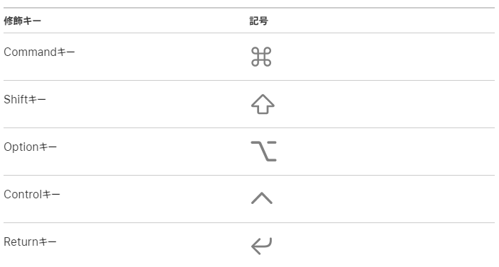

# TIL - Visual Studio Code

vscodeのまとめ。

## ショートカットまとめ

### detail

vscode起動時のwelcomeページに、プラットフォーム別のショートカット一覧がリンクされている。

[vscode keybords shortcuts for windows](https://code.visualstudio.com/shortcuts/keyboard-shortcuts-windows.pdf)

[vscode keybords shortcuts for macOS](https://code.visualstudio.com/shortcuts/keyboard-shortcuts-macos.pdf)

macOS側の記号は[ここ](https://support.apple.com/ja-jp/guide/mac-help/cpmh0011/mac)を参照するとわかる。

### reference

1. [Macのメニューに表示される記号](https://support.apple.com/ja-jp/guide/mac-help/cpmh0011/mac)
